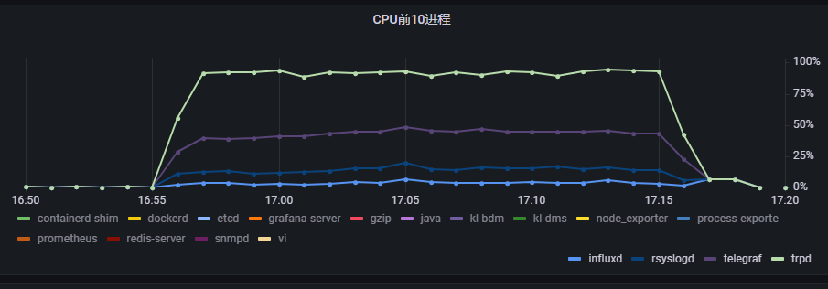
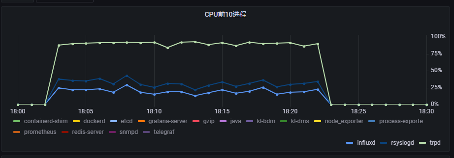
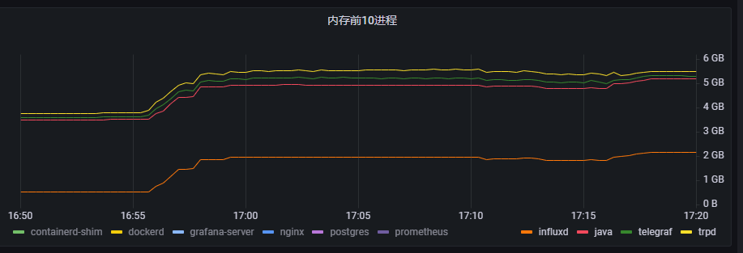
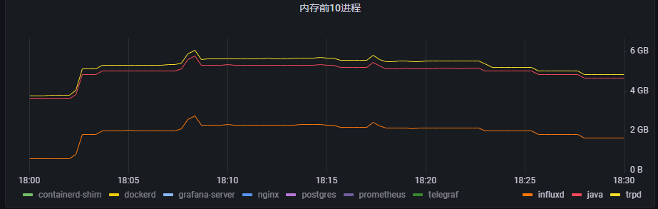
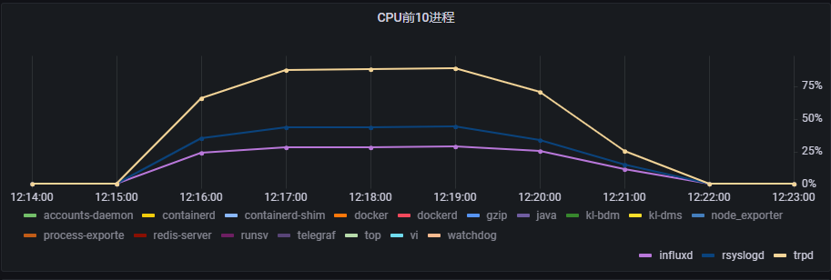
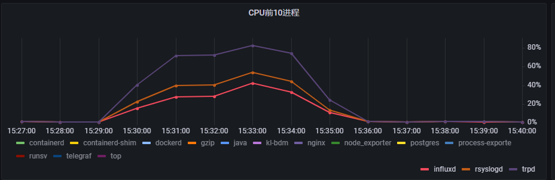
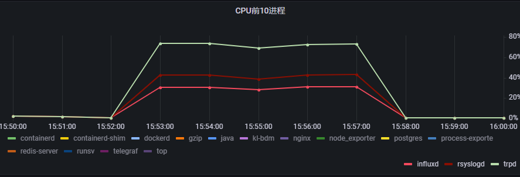
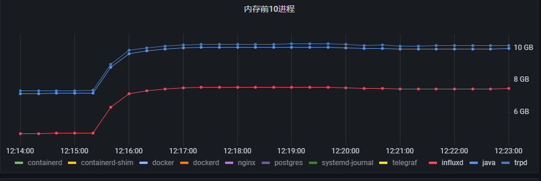
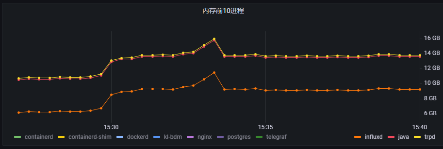
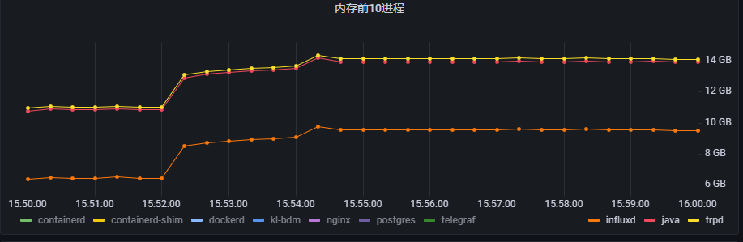

# influxDB在nginx上的性能测试

## 目标

- 测试influxDB在nginx的不同型号硬件上的极限性能，这些极限性能值会作为nginx各型号硬件的参数标准
- 对比多种influxDB的日志转发方案，找到最适合nginx的方案

ps：这里的测试不是追求TRP的高TPS，而是测试influxDB在nginx的极限性能。直白的意思就是，先保证influxDB在硬件上的日志入库成功率，再追求TRP的TPS

## 监控工具

使用以下监控工具来监控系统指标
- prometheus：安装在一个专门的服务器上
- grafana：安装在一个专门的服务器上
- telegraf和influxdb
- node-exporter、process-exporter：需要安装在nginx的硬件设备上

## 测试工具

- `jmeter`：常用HTTP测试工具
- `wrt`：格尔专用高性能测试工具

# 第一轮测试

## 环境

- `内存`：8g
- `CPU`：4核

## 技术方案

1. rsyslog->telegraf->influxDB
2. rsyslog->influxDB

## 测试结果对比

### 资源使用情况

ps：这是每个方案的最优化后的对比数据，这里的指标值都是大概的平均值

| 方案     |  应用         |  CPU使用率          |  内存使用率         |
| -------- | ------------- | -------------------- | -------------------- |
| 1        | trp           | 48%                  |    340MB           |
| 1        | rsyslog       | 10%                  |    50MB           |
| 1        | telegraf      | 29%                  |    300MB           |
| 1        | influxdb      | 4%                  |    1.97GB           |
| 2        | trp           | 60%                  |    360MB           |
| 2        | rsyslog       | 11%                  |    50MB           |
| 2        | influxdb      | 18%                 |    2G             |

- 方案1的CPU趋势图

- 方案2的CPU趋势图

- 方案1的内存趋势图

- 方案2的内存趋势图

### 结果情况

监控日志测试结果就是统计数据入库情况
| 方案     |  测试时长  |  TPS    |  请求数         |  日志入库量          |  成功率             |
| -------- | --------- |-------- |------------- | -------------------- | ------------------- |
| 1        | 20m      |  1574     | 1891621           | 742597           |    39.26%           |
| 2        | 20m       | 1587     | 1907253           | 1901794          |    99.71%           |

## 分析

根据测试结果，很明显可以看出telegraf太多资源，它所具备的转发功能rsyslog明显完成的更好，但是telegraf有解析、聚合计算的功能，实际上nginx现在只用到useragent解析。
使用telegraf，导致influxDB占用的资源很少，在高压力下日志入库效率很低。

## 结论

1. 方案2（rsyslog->influxDB）日志入库成功率更高；
2. 两个方案的TPS相差无几；
3. 如果是日志转发外部审计系统的场景，那么方案2会性能更好，TPS更高；但另一面是方案2无法做到解析useragnet获得客户端系统、浏览器类型、终端类型。

# 第二轮测试

## 环境

- `设备`：h1 10 i5
- `内存`：8g
- `CPU`：4核

## 技术方案

1. rsyslog->influxDB

## 测试情景

1. influxDB极限性能
2. TPS为9000次/s的情况
3. TPS为10000次/s的情况
4. TPS为11000次/s的情况

## 测试结果对比

### 资源使用情况

ps：这是每个方案的最优化后的对比数据，这里的指标值都是大概的平均值

| 测试情景     |  应用         |  CPU使用率          |  内存使用率         |
| -------- | ------------- | -------------------- | -------------------- |
| 1        | trp           | 44.4%                  |    189MB           |
| 1        | rsyslog       | 15.4%                  |    50MB           |
| 1        | influxdb      | 28.7%                  |    7.51GB         |
| 2        | trp           | 30%                  |    191MB            |
| 2        | rsyslog       | 11%                  |    50MB             |
| 2        | influxdb      | 34%                 |    9.16G             |
| 3        | trp           | 30%                  |    191MB            |
| 3        | rsyslog       | 11%                  |    50MB             |
| 3        | influxdb      | 32%                 |    9.16G             |
| 4        | trp           | 31%                  |    191MB            |
| 4        | rsyslog       | 11%                  |    50MB             |
| 4        | influxdb      | 30%                 |    9.61G             |

- 测试情景1的CPU趋势图

- 测试情景2的CPU趋势图

- 测试情景4的CPU趋势图

- 测试情景1的内存趋势图

- 测试情景2的内存趋势图

- 测试情景4的内存趋势图

### 结果情况

监控日志测试结果就是统计数据入库情况
| 方案     |  测试时长  |  TPS    |  请求数         |  日志入库量          |  成功率             |
| -------- | --------- |-------- |------------- | -------------------- | ------------------- |
| 1        | 5m      |  18439     | 5533531           | 3311636           |    59.85%           |
| 2        | 5m       | 8998     | 2699414           | 2699579          |    100%           |
| 3        | 5m       | 9997     | 2999206           | 2998276          |    99.96%           |
| 3        | 5m       | 10998     | 3299401           | 3194056          |    96.8%           |

## 分析

首先在测试情景1中，为了达到极限性能，经过各种参数优化后，堪堪达到60%。再想优化基本没空间了。
为了求证，到官网上找答案[https://docs.influxdata.com/influxdb/v1.8/guides/hardware_sizing/],在这里可以看到高于700000field/s的写入操作，建议使用集群。
我们计算一下现在的字段写入速率：3311636/5/60*56=618172,每条日志56个字段，实际上syslog的字段还有几个我没算进去，但我们看到618172已经非常接近700000。
另外我们的内存只有16G，而官方推荐4核8g的CPU建议内存是8-32G，实际在h1 10 i5型号中能提供给influxDB的内存也是有限的。也就是说，influxDB基本已经到极限了。

然后，根据实际测试10000TPS差不多能保证入库百分百。

## 结论

1. h1 10 i5型号的10000TPS基本能保证入库成功率，TPS超过越大数据丢失比率越大；
2. h1 10 i5型号在极限压力下，能保证60%的日志入库成功率；

# 总结

1. rsyslog->influxDB方案最优，日志入库成功率更高，并且如果是日志转发外部审计系统的场景，能保证TRP有更多的资源利用；
2. 兆芯设备由于TPS较低，日志基本能保证入库成功率接近百分百；
3. h1 10 i5型号的10000TPS基本能保证入库成功率，TPS超过越大数据丢失比率越大；
4. h1 10 i5型号在极限压力下，能保证60%的日志入库成功率；