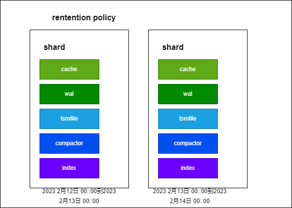
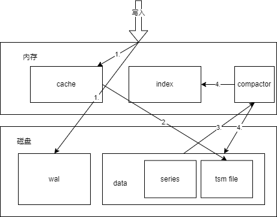
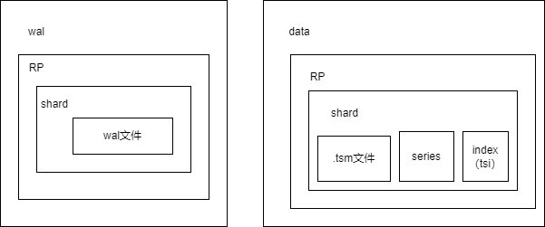

## 术语

参考[官方文档](https://docs.influxdata.com/enterprise_influxdb/v1.9/concepts/glossary)

### 数据库（database）

一个用于用户、保留政策、连续查询和时间序列数据的逻辑容器。

### measurement

InfluxDB数据结构的一部分，描述存储在相关字段的数据。测量值是字符串。相当于mysql的表。

### field

InfluxDB数据结构中的键值对，记录元数据和实际数据值。在InfluxDB数据结构中，字段是必须的，而且它们没有索引--对字段值的查询会扫描所有符合指定时间范围的point，因此，相对于标签来说，性能不高。

field是key-value结构，series中包含field key。

例如，我们存入user_access表的数据：
```
#protocol line#-measurement-#---------一组tag--------------------#----------------------一组field------------------#
insert          user_access,host=localhost,table_name=user_access   spent=10i,client_ip=10.0.9.9,url='../index',...
```
spent、client、url是一条数据中的field；host、table_name是tag。

### tag

InfluxDB数据结构中记录元数据的键-值对。标签是数据结构的一个可选的部分，但它们对于存储常用的元数据很有用；标签是有索引的，所以对标签的查询是有性能的。查询提示：将标签与字段进行比较；字段不被索引。

tag是key-value结构，series中会包含tag set（一组tag的key和value）。

### series

measurement + tag set + field key的逻辑分组，influxdb的索引存储是依据这样的逻辑分组。

注意，上面是官方文档的表述，在源码实现层面，实际上series只用到measurement + tag set，这就是为什么不同的文档博客对series的表达不一样。

### series cardinality

一个db节点的series的数目。可以衡量内存消耗的重要指标。

例如，一个measurement有两个tag：email 和 status，emial有3个值：tom@qq.com、lili@163.com、lilei@google.cn，status有两个值：on、off。
那么series cardinality = 3*2=6。

|    email      |      status    |
|---------------|----------------|
|   tom@qq.com  |       on      |
|   tom@qq.com  |       off      |
|   lili@163.com  |       on      |
|   lili@163.com  |       off      |
|   lilei@google.cn  |       on      |
|   lilei@google.cn  |       off      |

这里的计算方式也验证了series是measurement + tag set的逻辑分组

### point

在InfluxDB中，一个点代表一条数据记录，类似于SQL数据库表中的一条行。每个点。

- 有一个measurement，一个tag set，一个field key，一个field value，和一个时间戳。
- 是由其series和时间戳唯一识别的。

### 每秒point数目（points per second）

对数据被持久化到InfluxDB的速度的一种废弃的测量。该模式允许甚至鼓励记录每个point的多个度量值，使每秒point数目变得模糊不清。

写入速度一般是以values per second来引用的，这是一个更精确的度量。

### values per second

数据被持久化到InfluxDB的速度的首选测量标准。写入速度一般以每秒的数值为单位。

要计算每秒的数值速率，请将每秒写入的point数目乘以每个点存储的数值。例如，如果每个point有4个字段，一批5000个point每秒写入10次，那么values per second为：

4（每个point 4个field values）* 5000（一批次5000个point） * 10（每秒写10次）=200000 （values per second）

### 保留策略（rentention policy）

保留策略可以给measurement设定数据保留时长，比如设置180天，那么数据最多保留180天。

### 分片（shard）

一个分片包含实际编码和压缩的数据，并由磁盘上的TSM文件表示。每个分片都属于一个且仅属于一个分片组。在一个分片组中可能存在多个分片。每个分片包含一组特定的series。在一个给定的分片组中，所有属于给定series的point都将被储存在磁盘上的同一个分片（TSM文件）中。

### 分片组（shard group）

分片组是分片的逻辑容器。分片组是按时间和保留策略组织的。每个包含数据的保留策略都至少有一个相关的分片组。一个给定的分片组包含有该分片组所覆盖的时间间隔内的所有数据的分片。每个分片组所跨越的时间间隔就是分片持续时间。

## influxDB大致原理

主要分4块内容：写入、读取、删除。

### 写入

参考[官方文档](https://docs.influxdata.com/enterprise_influxdb/v1.9/concepts/storage_engine/)

influxDB的存储是按照shard存储的，shard是influxdb存储引擎TSM的具体实现。
首先看一下influxdb整体的存储数据结构:



- rentention policy：influxdb的rentention policy划分存储策略，可以设定保留时间；
- shard：时间片，按时间划分成多个shard，每个shard负责一段时间内数据的存储，每个shard都包含wal、cache、index、compactor、tsmfile、Compaction Planner、Compression和Writers/Readers；
- cache：缓存是存储在WAL中的数据的一个内存表示。它在运行时被查询并与存储在TSM文件中的数据合并。
- wal：WAL是一种写优化的存储格式，允许写是持久的，但不容易查询。对WAL的写入被附加到一个固定大小的段上。
- index：索引是一个跨分片的共享索引，提供对measurement、tag和series的快速访问。
- tsm file：tsm file以柱状格式存储压缩的系列数据。
- compactor：压缩器负责将不太优化的Cache和TSM数据转换为更适合阅读的格式。它通过压缩系列、移除已删除的数据、优化索引和将较小的文件合并成较大的文件来实现这一目标。
  
#### 写入流程



1. 写入influxdb时，会同时写wal文件及cache内存, wal用于宕机恢复cache
2. cache在达到配置中的阈值时，会进行snapshot快照,进行落盘
3. compactor会进行四次压缩(level1,2,3及full)，读取磁盘中tsm file
4. 压缩后的数据写入tsm file，同时压缩index，更新index内容

#### 磁盘中内容说明



- influxdb存储目录下有data、wal、meta3个目录，meta是元数据目录，data是存储数据内容目录，wal是宕机恢复数据目录；
- data下有database目录，database下是retention policy目录，在retention policy目录下是shard目录，shard目录下有.tsm文件、series目录，如果是tsi索引方式，shard目录下还会有index目录
- wal同data目录层次大致一样，就是在shard目录层级不同，它只包含wal文件
  
#### index的内容说明

index是包含measurement、tag set和seriesID的倒排索引。可以通过measurement、tag key、tag value查询定位到seriesID。

seriesID包含series以及一个可以定位数据存储在哪个文件块的要素。这个要素的获取过程比较复杂，笔者也没搞懂，可能是offset（描述block在文件中的位置），也可能是min timestamp和max timestamp。

通过seriesID可以定位到tsm文件的具体数据块。

（待后续更新...）

#### tsm文件内容说明

tsm文件存储header, blocks, index, footer等内容，文件设计目标就是可以快速的通过index定位到具体的block数据块，以便于查询到具体数据。
- index：索引，tsm文件中的index同内存中index是一致的。
- blocks：数据块

tsm文件内容比较复杂，笔者暂时没有梳理好，此处引用两个帖子：
[tsm文件内容](https://blog.csdn.net/lin819747263/article/details/103963554)
[tsm文件内容](https://blog.csdn.net/qq_40454136/article/details/123508446)

（待后续更新...）

#### 压缩

压缩是influxdb的最重要的一个内容，涉及到很多细节，在使用时，如果忽视这些细节可能会造成大问题。

压缩是一个经常性的过程，它将以写优化格式存储的数据迁移到一个更加读优化的格式。在分片处于写状态时，有一些压实的阶段发生。

- 快照：cache和WAL中的值必须转换为TSM文件以释放WAL段使用的内存和磁盘空间。这些压缩发生在缓存内存和时间阈值的基础上。
- 级别压缩：级别压缩（1-4级）随着TSM文件的增长而发生。TSM文件被从快照压缩到1级文件。多个1级文件被压缩以产生2级文件。这个过程一直持续到文件达到第4级（完全压实）和TSM文件的最大尺寸。除非需要进行删除、索引优化压缩或完全压缩，否则它们不会被进一步压缩。较低级别的压缩使用的策略是避免CPU密集型活动，如解压和合并块。更高级别的（因此频率较低）压缩将重新组合块，以完全压缩它们并提高压缩率。
- 索引优化：当许多第4级TSM文件累积时，内部索引变得更大，访问成本更高。索引优化压缩将系列和索引分割到一组新的TSM文件中，将特定系列的所有点分类到一个TSM文件。在索引优化之前，每个TSM文件包含大多数或所有series的点，因此每个文件包含相同的series索引。在索引优化之后，每个TSM文件包含最小series的point，文件之间几乎没有series重叠。因此，每个TSM文件都有一个较小的独特的series索引，而不是全series列表的。
- full压缩：完全压实（第4级压实）在一个分片长时间没有写入，或者分片上发生了删除时运行。完全压实产生一组最佳的TSM文件，包括所有来自级别和索引优化压实的优化措施。一旦一个分片被完全压实，除非有新的写入或删除存储，否则不会在其上运行其他压实。

经实践确定：
- 1级压缩：8个1级文件压缩1个2级文件，1级文件是cache和wal中的数据快照入盘后的文件，通常较小。
- 2级压缩：多个（一般是4个）2级文件压缩成1个3级文件。
- 3级压缩：多个（一般是4个）3级文件压缩成1个4级文件。
- full压缩：多个（一般是4个）4级文件压缩成多个5或6级文件，full压缩的触发是当shard分片时间范围内如果数据量大到一定层度（不一定是3级压缩文件达4个）。
- 只要达到触发压缩的文件数量，压缩就一定会发生。
- 当3级压缩和full压缩出现时，会消耗很多内存和CPU，主要是内存。因为程序是先读取低级文件到内存中，在压缩后再将高级文件入盘。
- 配置cache-snapshot-memory-size是cache达到快照入盘的大小，配置cache-max-memory-size是具体意义并不清晰，实验未找到足够的证据。
- 配置compact-throughput和compact-throughput-burst是压缩每秒最大落盘数据量，这两个值较重要，CPU性能越好，值可以设置的越大，这样压缩越快，压缩时间越短，吞吐量越大。
- 配置compact-full-write-cold-duration的意义：shard分片不再有写入和删除操作的compact-full-write-cold-duration长时间后，会做full压缩。该值设置超过retention policy的保留时长，可以避免full 压缩，但有个前提是数据量不大，如果数据量大会直接触发full压缩。

### 读取

读取流程：
1. 先通过retention policy和时间范围找到shard；
2. 再根据查询条件在shard的index中根据seriesID（meaurement、tag key、tag value）、时间范围查找到磁盘中tsm文件的block；
3. 加载文件中block的数据，并返回给调用方。

### 删除

以使用tsi索引为例讲解DELETE SQL删除数据的过程：

1. 根据DELETE SQL中指定的WHERE条件，从tsi/tsl文件中过滤得到满足条件的seriesID
2. 通过查找series index以及series segment文件得到seriesID对应的seriesKey
3. 查找TSM文件中的IndexBlock，判断该TSM是否存储seriesKey对应的数据（由于IndexBlock中保存的Key是由seriesKey + fieldKey组成，故只需要判断Key中的seriesKey与待删除的seriesKey是否相同就可以得到该TSM文件中是否存在seriesKey对应的时序数据），若存在，则将该Key对应的删除记录写入到该TSM对应的tombstone文件中，删除记录如下所示：
minTime和maxTime表示DELTE SQL中WHERE中指定的时间范围，表示删除指定时间范围的数据。

4. 如果Key在TSM中的数据需要全部删除（DELETE SQL中指定的时间范围完全覆盖Key在TSM中对应的时间范围），则将indirectIndex中的offsets数组中IndexBlock对应的的entry删除，这样在进行数据查找时由于在offsets中已经将对应项删除的原因，从而会跳过读取该部分惰性删除的数据；如果只需删除TSM中Key某段时间范围的数据（DELETE SQL中指定的时间范围与Key在TSM中对应的时间范围有重叠），则在indirectIndex中添加tombstone（[startTime, endTime)]，从而select查询时通过这些删除标志能够判断这部分数据是否已经删除。当TSM文件compaction时进行实际数据的删除生成新的TSM文件，TSM compaction完成后将tombstone文件删除。
   
5. InfluxDB采用LSM结构，删除内存中seriesKey在DELETE SQL指定时间范围的数据
6. 将DeleteRangeWALEntry写入wal文件中
7. 从series index以及series segment中查找待删除的seriesKey所对应你的series id
8. 将SeriesTombstoneLogEntry写入TSL文件中，并在内存中TSL对应的结构体中标记该seriesKey已经删除
9.  判断删除seriesKey所在的measurement中所有seriesKey是否已经删除，如果measurement中所有seriesKey均已删除，则从index中删除该measurement的索引信息：
  - 从TSL以及TSI中查找除所有该measurement包含的tagKey，将tagKey对应的TagKeyTombstoneLogEntry写入TSL文件，同时在内存中TSL对应的结构体中标记该tagKey已经删除
  - 从TSL以及TSI中查找上述tagKey对应的所有tagValue，将tagValue对应的TagValueTombstoneLogEntry写入TSL文件，并在TSL对应的结构体中标记该tagValue已经删除
  - 从fields.idx中删除该measurement的field信息
  
10.   将待删除的series id对应的SeriesTombStoneEntry写入series segment文件中，同时在series index的内存结构体重将该series id标记成删除
