# 准备环境

根据安装手册成功安装后，在本机的hosts文件中配置下面的内容，就可以访问 [蓝鲸paas](http://paas.bktencent.com/)

```
10.0.247.133 paas.bktencent.com cmdb.bktencent.com job.bktencent.com jobapi.bktencent.com bkapi_check.bktencent.com apigw.bktencent.com bkapi.bktencent.com nodeman.bktencent.com
```

## 平台简介

- paas：运维平台基础底座，相当于操作系统；
- 配置平台：配置定义，定义业务、集群、模块等CI信息，并关联其与节点的关系，最终构建拓扑；
- 节点管理：纳管节点，添加节点的时候会在节点上安装agent；
- 标准运维：界面化的ansible的运维功能；
- 监控平台：仪表盘、告警、数据探索、观测场景、集成第三方监控等功能；

# 入门级监控

开箱即用 -- 适用于初级用户，可进行主机监控、进程监控、官方监控插件、常用仪表盘等。

## 整体流程

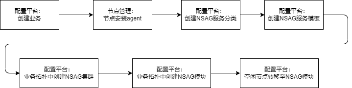

## 配置平台：创建业务

蓝鲸平台是基于业务去运维的，首先需要到配置平台创建业务。

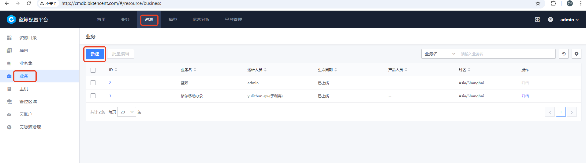

## 节点管理：节点安装agent

节点管理新增节点，平台会给节点安装agent

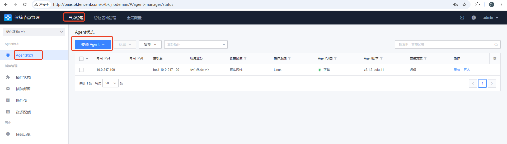

## 配置平台：创建NSAG服务分类

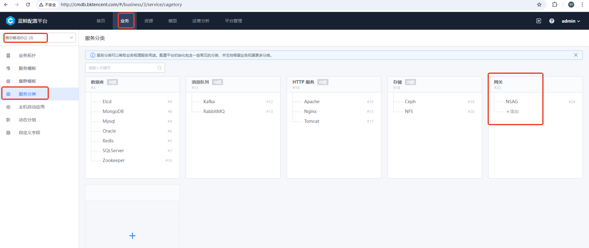

## 配置平台：创建NSAG服务模板-1

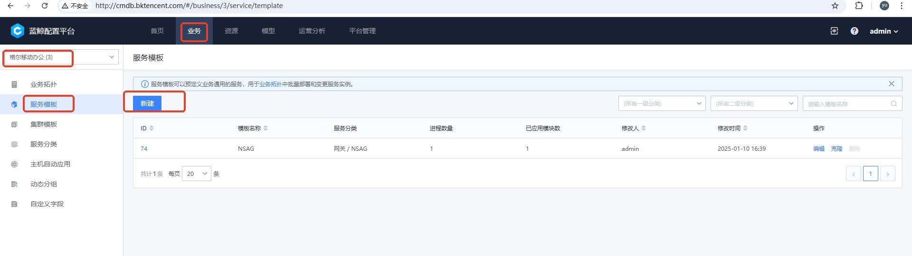

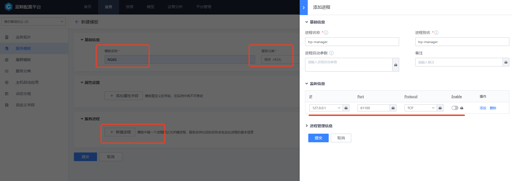

## 配置平台：业务拓扑中创建NSAG集群

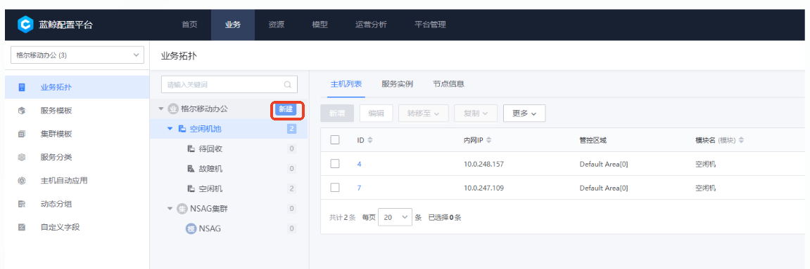

## 配置平台：业务拓扑中创建NSAG模块

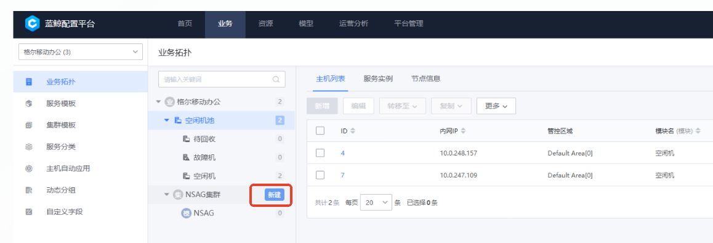

## 配置平台：空闲节点转移至NSAG模块-1

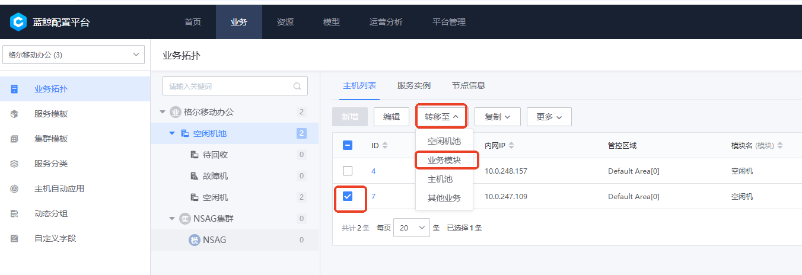

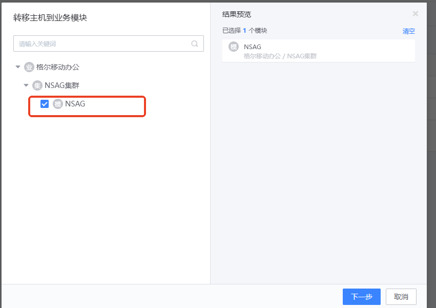

## 监控查看

- 主机查看
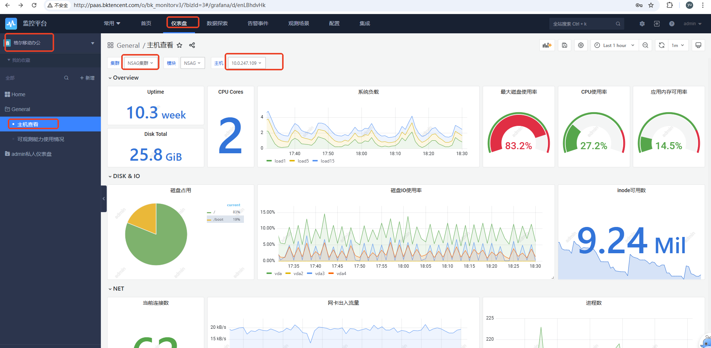

- 进程查看
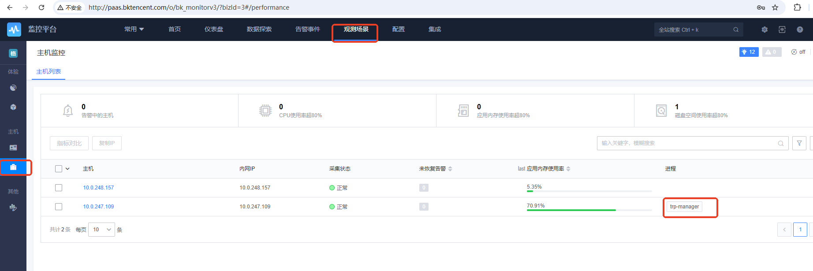
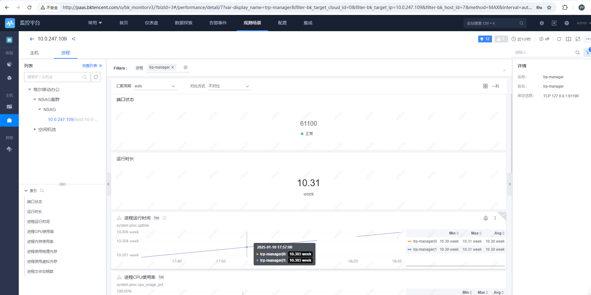
