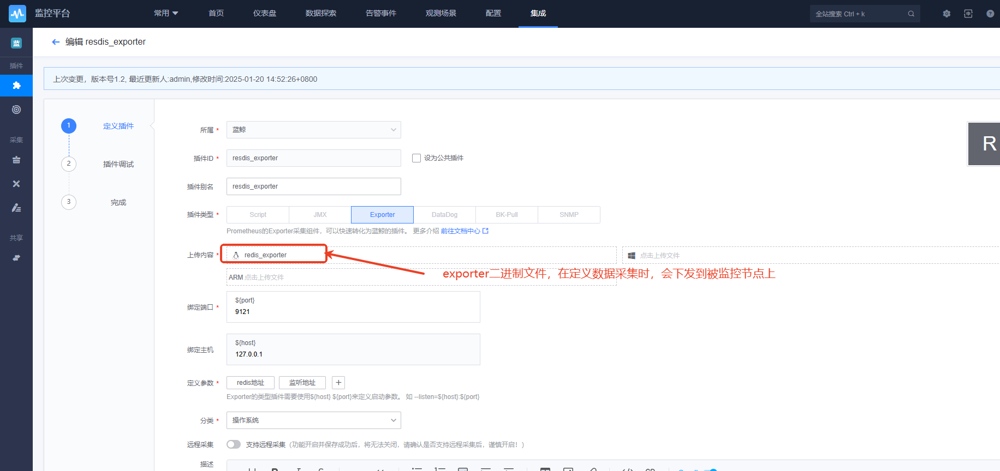
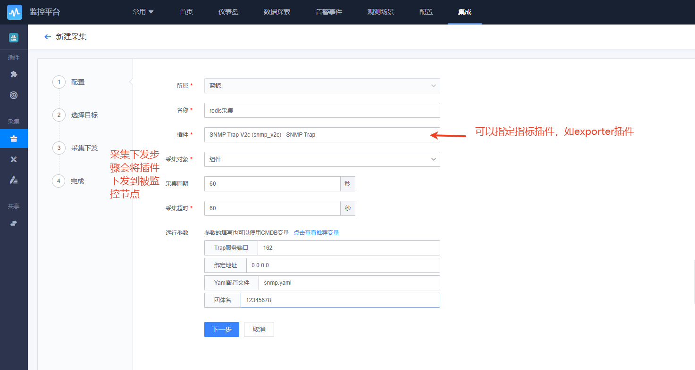
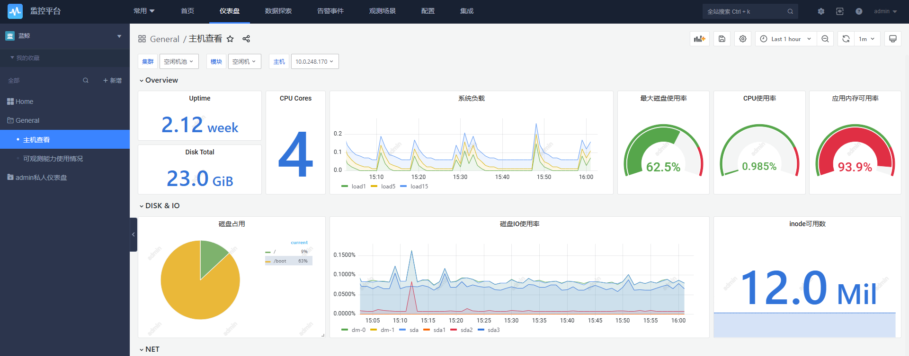
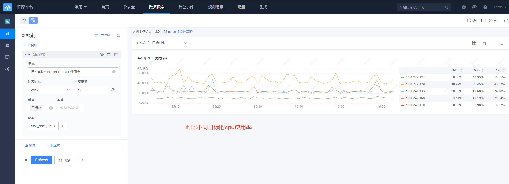
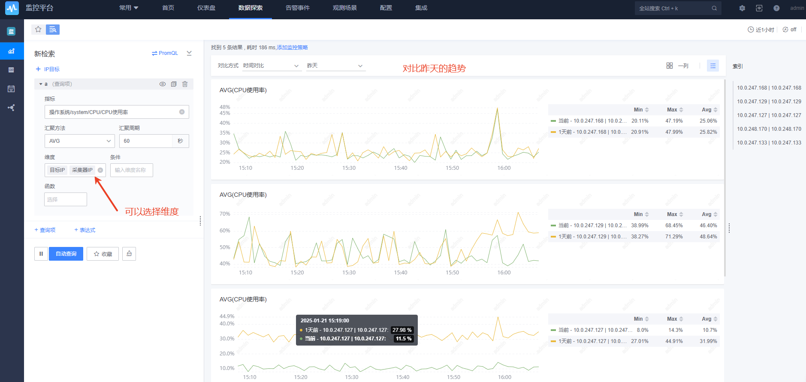
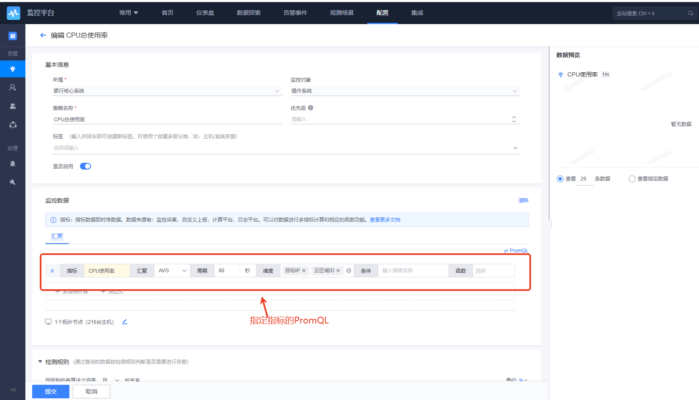
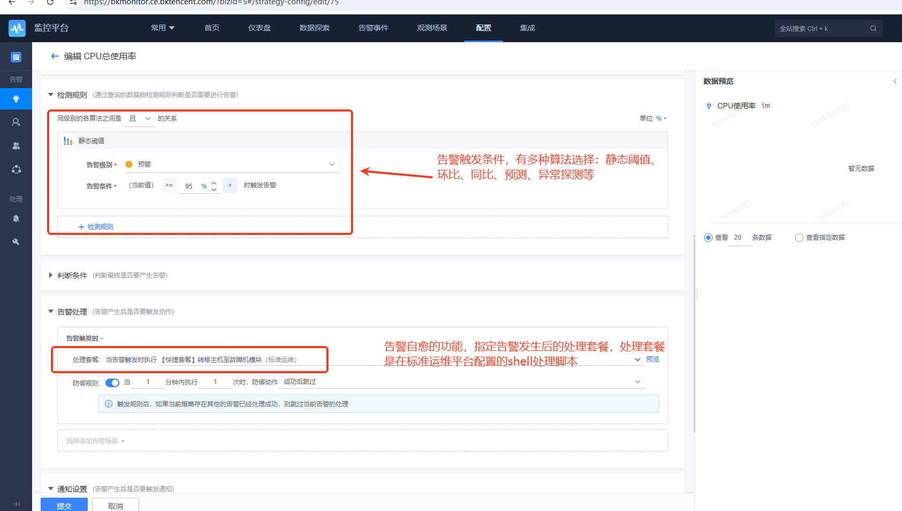
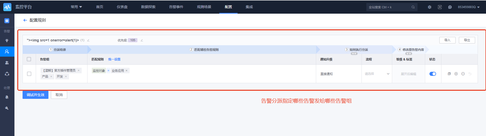
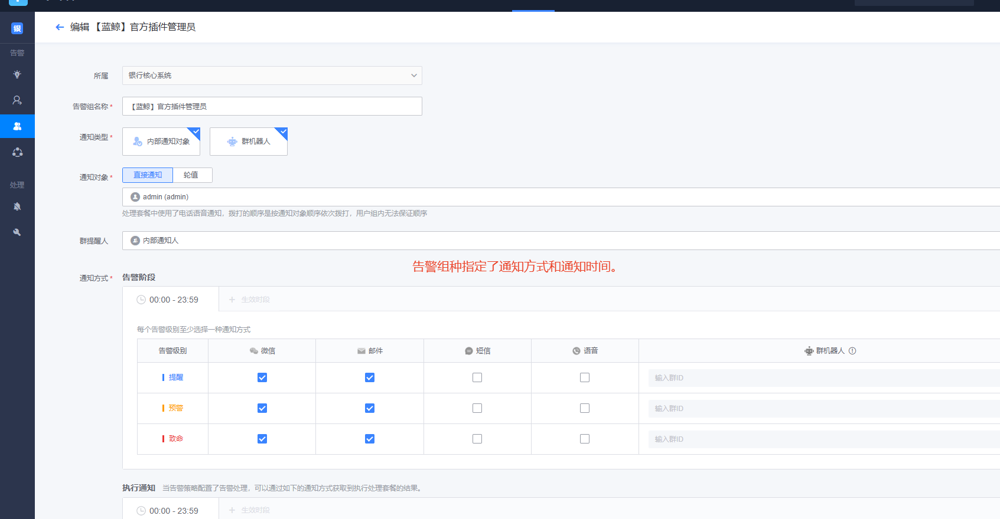

# 蓝鲸监控小结概述

从监控操作流程的各主要环节依次大概描述其功能和价值。
监控操作流程是：采集-》数据探索和可视化-》告警策略-》告警通知-》故障自愈

## 采集

### 定义指标插件

定义指标插件后，在下一步定义数据采集时，指标插件将被下发到被监控节点，用于执行数据采集任务。

蓝鲸自有 Agent 支持主机监控和进程监控，并在节点纳管时自动安装。常见的指标插件包括：

1. exporter: 可以下发exporter到主机并采集
   
2. datadog：可以下发datadog agent并采集
3. bk-pull：可以采集主机上原有的exporter
4. snmp：集成了snmp-exporter采集，可以定义snmp.yml，也就是snmp-exporter的配置文件
5. 脚本方式：利用shell采集信息
6. JMX：可以采集java的JMX接口

### 定义数据采集

定义数据采集，可以指定用哪个指标插件采集哪些节点。另外数据采集定义后会在观测场景中生成相应的观测场景。

## 数据探索和可视化

### 可视化

仪表板图表，就是grafana

### 查看指标、trace、日志

可以查看指标、trace、日志信息，并进行不同维度地对比

## 告警策略

相当于prometheus的告警规则，检测算法丰富，还支持智能异常监检测、智能预测，算法有：静态阈值 、 同比策略（简易） 、同比策略（高级）、环比策略（简易）、环比策略（高级）、同比振幅 、周比区间 、环比振幅。

产品使用文档对检测算法的使用场景、使用方法有详细的描述，比较有价值：[检测算法](https://bk.tencent.com/docs/markdown/ZH/Monitor/3.8/UserGuide/ProductFeatures/alarm-configurations/algorithms.md)

## 告警通知

告警通知功能是通过告警分派和告警组两个定义方式实现。

## 故障自愈

故障自愈也就是告警处理，是在定义告警策略时指定的。在告警消息发送给运维人员时会带有告警回调接口，运维人员触发一个告警回调，就会触发标准运维平台上的一个处理套餐，套餐会运行处理脚本。

## 功能的优缺点

### 优点

1. 支持指标、日志、事件和tracing这4种监控方式
2. 支持了多种常用的采集方式，并且整合为了Prometheus数据结构存储，使用PromQL进行查询
3. 告警策略（相当于prometheus的告警规则）算法丰富，对使用场景、使用方法有详细的描述
4. 故障自愈
5. 社区活跃，支撑积极性还行

### 缺点

1. 告警通知比较复杂，配置告警通知方式，如微信、邮件等比较复杂，钉钉也不一定支持
2. bug比较多
