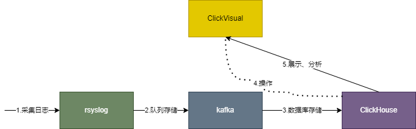
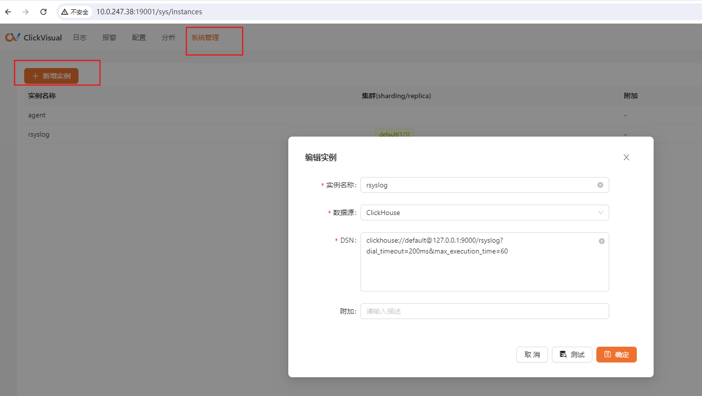
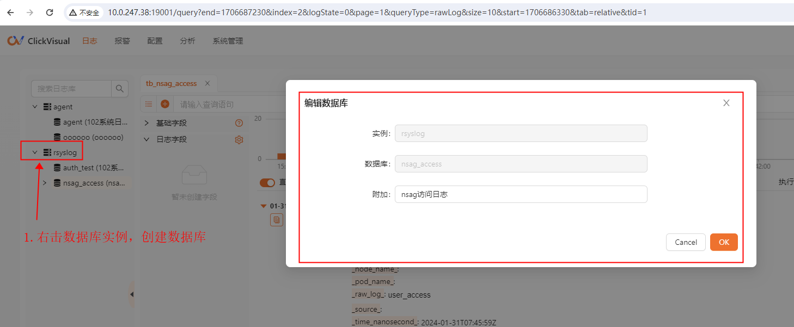
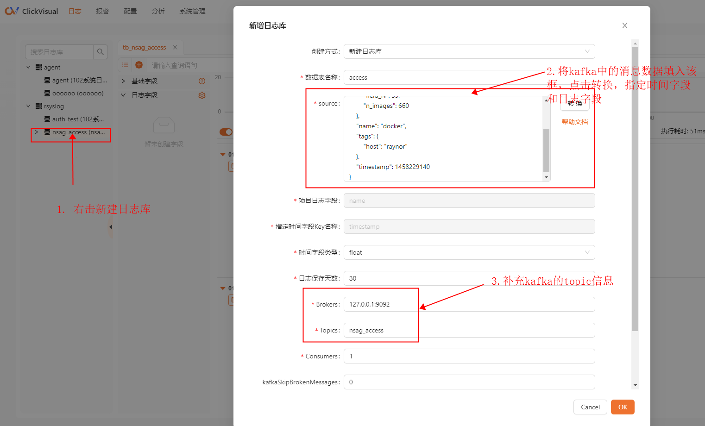
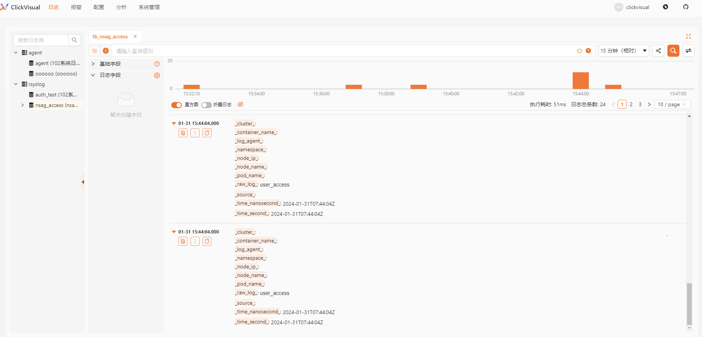

## 调研clickvisual的目的及结论

此处首先说明调研clickvisual的目的和结论。

目的：

1. 了解clickvisual agent和clickvisual的使用方法，是否如其官方文档所说可以避免大的日志架构，直接使用该两个程序即可分析节点上的日志。
2. 了解clickvisual的基本使用方法。

结论：

1. clickvisual agent的功能并不完善，还无法使用。
   - 首先，官方文档没有足够的使用说明
   - 其次，网上也没有相关资料
   - 另外，通过阅读源码，尝试配置和使用agent，最终失败。

2. clickvisual结合clickhouse使用是基于一个庞大的日志分析架构，并且使用上并不方便，远不如kibana这些成熟的产品。

## 文档目的

简单说明clickvisual最常见的使用方式，以及其安装和操作步骤。

## 架构说明



1. 采集日志：使用日志采集器采集日志，常见的有filebeat、logstash、telegraf等，本实践使用rsyslog接收nginx服务的访问日志；
2. 队列存储：分布式、并发，数据准确性保证；
3. 数据库存储：数据落地，存储到clickhouse；
4. 操作: clickvisual创建clickhouse的日志数据库，对接kafka的topic和clickhouse的日志数据库；
5. 查询和分析；clickvisul从clickhouse中查询和分析日志。

## 安装说明

### 安装clickhouse

#### 下载地址

https://github.com/ClickHouse/ClickHouse/releases

如果是非docker环境建议采用rpm或deb包进行安装，建议不要使用tar.gz压缩包安装。

#### 安装

以deb包为例，需要安装clickhouse-client_23.12.2.59_amd64.deb、clickhouse-common-static-dbg_23.12.2.59_amd64.deb、clickhouse-common-static_23.12.2.59_amd64.deb、clickhouse-keeper-dbg_23.12.2.59_amd64.deb、clickhouse-keeper_23.12.2.59_amd64.deb、clickhouse-server_23.12.2.59_amd64.deb。

- 安装deb包，安装需要按照一定顺序，否则会出现依赖问题

```
root# dpkg -i clickhouse-common-static_23.12.2.59_amd64.deb
root# dpkg -i clickhouse-common-static-dbg_23.12.2.59_amd64.deb
root# dpkg -i clickhouse-keeper-dbg_23.12.2.59_amd64.deb
root# dpkg -i clickhouse-keeper_23.12.2.59_amd64.deb
root# dpkg -i clickhouse-server_23.12.2.59_amd64.deb
root# dpkg -i clickhouse-client_23.12.2.59_amd64.deb
```

deb包安装过程中出现问答一律yes通过。

- 启动clickhouse-server服务

```
root# systemctl restart clickhouse-server
```

- 使用clickhouse-client可以访问服务端

```
root@localhost:/opt# clickhouse-client -m
ClickHouse client version 23.11.2.11 (official build).
Connecting to localhost:9000 as user default.
Connected to ClickHouse server version 23.11.2.

Warnings:
 * Maximum number of threads is lower than 30000. There could be problems with handling a lot of simultaneous queries.

localhost :) show databases
;

SHOW DATABASES

Query id: 86c5300e-14a6-4b17-b61a-fab5f824c288

┌─name───────────────┐
│ INFORMATION_SCHEMA │
│ auth_test          │
│ default            │
│ information_schema │
│ nginx_access        │
│ rsyslog            │
│ system             │
└────────────────────┘

7 rows in set. Elapsed: 0.009 sec. 

localhost :) 
```

### 安装kafka
#### 依赖

jdk1.8

### 下载地址

https://archive.apache.org/dist/kafka/3.6.0/kafka_2.12-3.6.0.tgz

#### 安装及配置

1. 解压压缩包到/opt目录下，命名为kafaka

2. 运行zookeeper，我们使用kafka自带的zookeeper，修改../config/zookeeper.properties配置文件，可以修改ip和端口，然后启动程序：

```
root# ./bin/zookeeper-server-start.sh ./config/zookeeper.properties & 
```

3. 运行kafka，修改../config/server.properties配置文件，默认可以不用修改，然后启动程序：
```
root# ./kafka-server-start.sh ../config/server.properties &
```

4. 其他主要命令：
创建topic
```
root# ./kafka-topics.sh --create --topic mytopic --bootstrap-server localhost:9092 --partitions 1 --replication-factor 1
```

消费topic，查看topic中数据
```
root# ./kafka-console-consumer.sh --topic mytopic --bootstrap-server localhost:9092 --from-beginning
```

生产消息，往topic中写入消息
```
root# ./kafka-console-producer.sh --topic mytopic --bootstrap-server 10.8.30.117:9092
```

查看topic列表
```
root# ./kafka-topics.sh -list --bootstrap-server localhost:9092
```

### 安装clickvisual

#### 依赖

mysql、redis

### 下载地址

https://github.com/clickvisual/clickvisual/releases/tag/v1.0.0-rc12/clickvisual-v1.0.0-rc12-linux-amd64.tar.gz

#### 安装和配置

1. 解压压缩包，放到clickv目录

```
root# mkdir clickv
root# mv clickvisual-v1.0.0-rc12-linux-amd64.tar.gz clickv/
root# tar -xzvf clickvisual-v1.0.0-rc12-linux-amd64.tar.gz
```

2. 修改config/default.toml,修改redis和mysql的配置：

```
[redis]
debug = true
addr = "127.0.0.1:6379"
writeTimeout = "3s"
password = ""

[mysql]
debug = true
# database DSN
dsn = "root:123456@tcp(127.0.0.1:3306)/clickvisual?charset=utf8mb4&collation=utf8mb4_general_ci&parseTime=True&loc=Local&readTimeout=1s&timeout=1s&writeTimeout=3s"
# log level
level = "debug"
# maximum number of connections in the idle connection pool for database
maxIdleConns = 5
```

3. 启动程序

```
root# nohup ./clickvisual server &>stdout.log &
```

4. 可配置自启动服务：

```
[Unit]
Description=clickvisual
After=network.target

[Service]
Type=working
User=root
Group=root
Restart=on-failure
RestartSec=10
ExecStart=/usr/local/clickvisual/clickvisual --config /usr/local/clickvisual/config/default.toml 
ExecStop=ps -ef |grep clickvisual |grep -v grep|awk '{print $2}'|xargs kill -9
PrivateTmp=true
LimitNOFILE=102400
 
[Install]
WantedBy=multi-user.target
```
## 日志采集和消息队列配置

在使用clickvisual之前，我们首先要将日志数据存储kafka。

### 链路图

我们通过以下组件，将nginx的访问日志存储到kafka。


### nginx配置

这儿使用了nginx数据源，配置访问日志传输到日志服务的rsyslog。


### rsyslog配置

```
module(load="imudp")
input(type="imudp" address="0.0.0.0" port="60514" ruleset="nginxRuleSet")

module(load="omkafka")


template(name="userAccessFor3Format" type="string"
        string="<%PRI%>1 %TIMESTAMP:::date-rfc3339% %fromhost-ip% %APP-NAME% - %APP-NAME% - %$.userAccessFor3Msg:15:$%\n")

ruleset(name="nginxRuleSet"  queue.size="10000" queue.workerthreads="4" queue.TimeoutEnqueue="0" ) {
  if($app-name == "user_access") then {
     set $.userAccessFor3Msg = replace($msg,"]","");
        
     action(type="omfwd" Protocol="udp" TCP_Framing="octet-counted" Target="127.0.0.1" Port="64200" Template="userAccessFor3Format")
  }
  
}
```

### telegraf配置

为什么要穿插一个telegraf，是因为clickvisual无法实现logfmt日志格式解析，所以加一个telegraf将logfmt格式转化为json格式
```
[[processors.rename]]
  namepass = ["syslog"]
  ## Specify one sub-table per rename operation.
  [[processors.rename.replace]]
    measurement = "syslog"
    dest = "user_access"
  [[processors.parser]]
    parse_fields = ["message"]
    merge = "override"
    data_format = "logfmt"

        
[[inputs.syslog]]
  server = "udp://127.0.0.1:64200"

[[outputs.kafka]]
  brokers = ["localhost:9092"]
  topic = "nginx_access"
  data_format = "json"

[agent]
  debug = true
```

### kafka中日志数据样例

通过kafka消费者命令查看日志数据是否正常入到kafka：

```
root# ./kafka-console-consumer.sh --topic nginx_access --bootstrap-server localhost:9092 --from-beginning
{"fields":{"app_id":"pps","bytes_recv":547,"bytes_sent":905,"client_ip":"10.0.200.2","client_port":41412,"client_request_addr":"https://10.0.247.128:443","current_upstream":"http://127.0.0.1:60500","facility_code":18,"http_host":"10.0.247.128","id":"12cec0760bef240a071e02d28f0ecdd2","message":" app_id=\"pps\" bytes_recv=547 bytes_sent=905 cert_cn=\"\" cert_email=\"\" cert_gn=\"\" cert_l=\"\" cert_o=\"\" cert_ou=\"\" cert_st=\"\" client_id=\"\" client_ip=\"10.0.200.2\" client_port=\"41412\" client_request_addr=\"https://10.0.247.128:443\" client_security_mark=\"\" current_upstream=\"http://127.0.0.1:60500\" http_host=\"10.0.247.128\" id=\"12cec0760bef240a071e02d28f0ecdd2\" media_type=\"\" method=\"GET\" multi_location=\"/\" parent_span_id=\"\" pass_channel=\"http_reverse\" proxy_local_ip=\"127.0.0.1\" proxy_local_port=\"19138\" proxy_request_addr=\"127.0.0.1:60500\" request_args=\"ext=ZbdNCRnyOWZhSVBQ%2BE6TBHOzHLFL5CQ%2FeMZdDvVO1rYZxDvNAEEfuU7GLMWMYtg4Jce48PPPxgzh3KF%2Bvv%2FGpYgX6fmgmfQ4JVoEcZVFvGiNhu0UQHqsQBRyhMBzMx6a0LIes3EusRBJzeKlvdiGcVm%2FUhg9X73KAKaCBcXuXiZAzual6UNZXCi0%2BZl9ux1n\" resource_url=\"127.0.0.1:60500\" result=\"success\" result_detail=\"\" service_info=\"10.0.247.128:443\" session_id=\"\" session_type=\"\" spent=124 ssl_cipher=\"ECC-SM4-SM3\" ssl_client_verify_code=0 ssl_handshake_code=0 ssl_handshake_time=100 ssl_protocol=\"GMVPN\" ssl_session_reused=\".\" status=200 term_gps=\"\" term_id=\"\" term_location=\"\" term_model=\"\" term_type=\"\" trace_id=\"12cec0760bef240a071e02d28f0ecdd2\" upstream_bytes_received=828 upstream_connect_time=1 upstream_header_time=123 upstream_response_time=124 upstream_status=200 url=\"/nginx/v1/my/vpn/ticket?ext=ZbdNCRnyOWZhSVBQ%2BE6TBHOzHLFL5CQ%2FeMZdDvVO1rYZxDvNAEEfuU7GLMWMYtg4Jce48PPPxgzh3KF%2Bvv%2FGpYgX6fmgmfQ4JVoEcZVFvGiNhu0UQHqsQBRyhMBzMx6a0LIes3EusRBJzeKlvdiGcVm%2FUhg9X73KAKaCBcXuXiZAzual6UNZXCi0%2BZl9ux1n\" user_agent=\"nginx_Client/2.3.0-test3.240129 (android_os12_api31) okhttp/4.9.3.k6\" user_full_name=\"\" user_group_info=\"\" user_id=\"\" user_name=\"\" user_type=\"\"","method":"GET","msgid":"user_access","multi_location":"/","pass_channel":"http_reverse","proxy_local_ip":"127.0.0.1","proxy_local_port":19138,"proxy_request_addr":"127.0.0.1:60500","request_args":"ext=ZbdNCRnyOWZhSVBQ%2BE6TBHOzHLFL5CQ%2FeMZdDvVO1rYZxDvNAEEfuU7GLMWMYtg4Jce48PPPxgzh3KF%2Bvv%2FGpYgX6fmgmfQ4JVoEcZVFvGiNhu0UQHqsQBRyhMBzMx6a0LIes3EusRBJzeKlvdiGcVm%2FUhg9X73KAKaCBcXuXiZAzual6UNZXCi0%2BZl9ux1n","resource_url":"127.0.0.1:60500","result":"success","service_info":"10.0.247.128:443","severity_code":6,"spent":124,"ssl_cipher":"ECC-SM4-SM3","ssl_client_verify_code":0,"ssl_handshake_code":0,"ssl_handshake_time":100,"ssl_protocol":"GMVPN","ssl_session_reused":".","status":200,"timestamp":1706540405000000000,"trace_id":"12cec0760bef240a071e02d28f0ecdd2","upstream_bytes_received":828,"upstream_connect_time":1,"upstream_header_time":123,"upstream_response_time":124,"upstream_status":200,"url":"/nginx/v1/my/vpn/ticket?ext=ZbdNCRnyOWZhSVBQ%2BE6TBHOzHLFL5CQ%2FeMZdDvVO1rYZxDvNAEEfuU7GLMWMYtg4Jce48PPPxgzh3KF%2Bvv%2FGpYgX6fmgmfQ4JVoEcZVFvGiNhu0UQHqsQBRyhMBzMx6a0LIes3EusRBJzeKlvdiGcVm%2FUhg9X73KAKaCBcXuXiZAzual6UNZXCi0%2BZl9ux1n","user_agent":"nginx_Client/2.3.0-test3.240129 (android_os12_api31) okhttp/4.9.3.k6","version":1},"name":"user_access","tags":{"appname":"user_access","facility":"local2","host":"localhost","hostname":"10.0.247.128","severity":"info","source":"127.0.0.1"},"timestamp":1706511634}
```

我们可以看到访问日志正常入到了kafka，下一步我们将使用clickvisual分析访问日志。

## clickvisual使用说明

### 添加实例

首先要添加clickhouse实例：



### 在实例上新建数据库



### 新增日志库

到了最关键的一步新增日志库，这一步实际做了3个操作：

1. 创建了clickhouse的一个kafka引擎表，从kafka的topic中采集数据到该表中；
2. 创建了一个视图，用于存储数据；
3. 创建了一个stream管道，将kafka引擎表的数据导入到视图中；

此处有很多疑问，为什么clickhouse会有这样的设计？待日后了解

具体操作为，右击上一步中创建的数据库，选择新建日志库：



创建日志库后即可看到日志数据：


