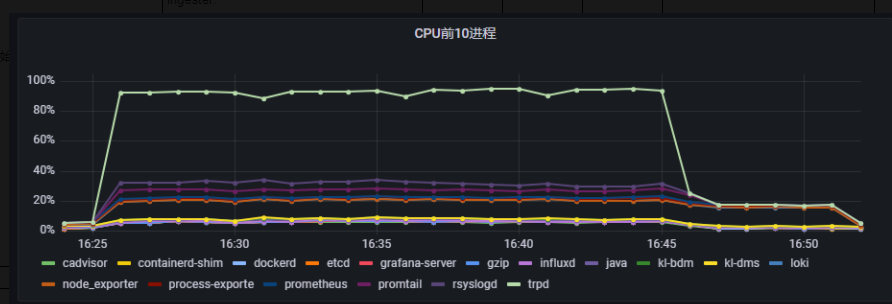

# 性能压测

## 目标

- 比较不同日志审计技术的性能差异，找出适合网关nginx的最优方案
- 了解各个日志技术的性能优化方法，记录较重要的参数的设置方法

## 环境

- `设备`：国产兆芯设备，ubuntu
- `内存`：8g
- `CPU`：4核

## 监控工具

使用以下监控工具来监控系统指标
- prometheus
- grafana
- telegraf和influxdb
  
这些工具都会安装在测试机器上，监控系统的常规指标（如CPU、内存、磁盘）并不会使用很多资源

## 测试工具

- `jmeter`：常用HTTP测试工具

## 测试情况汇总


# 第一轮测试

## 技术方案
1. rsyslog->telegraf->influxDB
2. rsyslog->telegraf->loki

## 测试结果对比

### 资源使用情况

ps：这是每个方案的最优化后的对比数据，第一轮统计的CPU使用率不准，因为是用的容器CPU指标，相对于宿主机来说不是这个使用率。
另外这里的指标值都是大概的平均值，具体情况可以看图表

| 方案     |  应用         |  CPU使用率          |  内存使用率         |
| -------- | ------------- | -------------------- | -------------------- |
| 1        | trp           | 80%                  |    250MB           |
| 1        | telegraf      | 4%                  |    450MB           |
| 1        | influxdb      | 2%                  |    400MB           |
| 2        | trp           | 80%                  |    250MB           |
| 2        | telegraf      | 5%                  |    250MB           |
| 2        | loki           | 2%                 |    1G             |

- 方案1的CPU趋势图


- 方案2的CPU趋势图


- 方案1的内存趋势图


- 方案2的内存趋势图


### 结果情况

监控日志测试结果就是统计数据入库情况
| 方案     |  测试时长  |  TPS    |  请求数         |  日志入库量          |  成功率             |
| -------- | --------- |-------- |------------- | -------------------- | ------------------- |
| 1        | 20m      |  1713     | 2055643           | 212256           |    10.33%           |
| 2        | 20m       | 1842     | 2210870           | 250301           |    11.32%           |

## 分析

一个请求数对应一条日志，从结果可以看出入库日志数目于请求数不符，差很多，两个方案都如此。

首先，判断是否inflxDB或者loki的问题？利用tcpdump抓包工具，抓取telegraf发给influxDB和loki的数据包，发现端口数据同入库量基本一致，所以排除是influxDB或loki的问题。

```
# 抓包命令，硬件接口一般是lo回环口
tcpdump -i lo port 64300 -w influxdb_20220901_n.pcap
```

然后，判断是否是telegraf的问题？同样是利用tcpdump抓包工具，抓取rsyslog发给telegraf的数据包，发现数据同请求数基本一致，知道了原因在于telegraf。

后面经过各种调试及测试，发现了问题在于telegraf的[inputs.koal_syslog]插件。

## 结论

1. loki的cpu消耗与influxDB差不多，平均都比较低，都在2%左右；云主机上loki的cpu要低于influxDB，硬件主机总体上是差不多的；
2. loki的内存比influxDB高，loki达1G，influxDB才400MB；
3. loki的查询速度较慢，记录规则消耗资源较多，当定制了31个记录规则时，CPU飙升到20%-40%左右
4. loki的存储日志量要大于influxDB；存储耗时上没有观察；
5. telegraf传输日志有瓶颈，日志量始终远少于请求量，当同时运行promtail的时候，promtail转发日志几乎百分百存储进了loki

## 发现问题

1. telegraf的[[inputs.koal_syslog]]插件存在性能瓶颈
2. 资源在多次压测后，无法访问
3. docker映射的端口无法访问，被iptables阻止了，未知原因

# 第二轮测试

## 前提

改用telegraf的[[inputs.syslog]]插件，顺利解决了telegraf的转发日志丢失问题。

## 技术方案

1. rsyslog->telegraf->influxDB
2. rsyslog->telegraf->loki
3. 方案2加上31条记录规则，记录规则是用于统计计算，可以统计出错误率、发生4xx错误的客户端、请求量等各类指标

## 测试结果对比

### 资源使用情况

ps：这是每个方案的最优化后的对比数据，第二轮统计的CPU使用率不准，因为是用的容器CPU指标，相对于宿主机来说不是这个使用率。
另外这里的指标值都是大概的平均值，具体情况可以看图表

| 方案     |  应用         |  CPU使用率          |  内存使用率         |
| -------- | ------------- | -------------------- | -------------------- |
| 1        | trp           | 50%                  |    250MB           |
| 1        | telegraf      | 30%                  |    1G           |
| 1        | influxdb      | 5%                  |    1G           |
| 2        | trp           | 50%                  |    250MB           |
| 2        | telegraf      | 30%                  |    1.5G           |
| 2        | loki           | 3%                 |    1G             |
| 3        | trp           | 46%                  |    250MB           |
| 3        | telegraf      | 28%                  |    1.5G           |
| 3        | loki           | 12%                 |    750MB             |

- 方案1的CPU趋势图


- 方案2的CPU趋势图


- 方案3的CPU趋势图


- 方案1的内存趋势图


- 方案2的内存趋势图


- 方案3的内存趋势图


### 结果情况

监控日志测试结果就是统计数据入库情况
| 方案     |  测试时长  |  TPS    |  请求数         |  日志入库量          |  成功率             |
| -------- | --------- |-------- |------------- | -------------------- | ------------------- |
| 1        | 20m      |  1966     | 2362771           | 611606           |    25.89%           |
| 2        | 20m       | 1880     | 2256260           | 994731           |    44.09%           |
| 3        | 20m       | 1934     | 2321454           | 690722           |    29.75%           |

## 分析

两种方案都存在大量的数据丢失率，问题在于telegraf的缓冲机制不够好，各中间件在大数据的压力下，资源不够时，telegraf会丢弃大量数，从其日志中可以看见。

```
2022-09-01T15:38:43.896829898+08:00 2022-09-01T07:38:43Z E! [outputs.influxdb] When writing to [http://127.0.0.1:64300]: failed doing req: Post "http://127.0.0.1:64300/write?db=telegraf&rp=user_access": context deadline exceeded (Client.Timeout exceeded while awaiting headers)
2022-09-01T15:38:43.897884513+08:00 2022-09-01T07:38:43Z E! [agent] Error writing to outputs.influxdb: could not write any address
2022-09-01T15:38:43.898789405+08:00 2022-09-01T07:38:43Z W! [outputs.influxdb] Metric buffer overflow; 3598 metrics have been dropped
2022-09-01T15:38:45.738369382+08:00 2022-09-01T07:38:45Z W! [outputs.influxdb] Metric buffer overflow; 2079 metrics have been dropped
```

loki表现稍好，但也不能避免数据丢失，原因就在于资源不足，无法支撑这么多软件工作。另外，telegraf不是loki的最优收集器，telegraf主要做数据的解析处理，loki也会做解析处理操作，两者功能重复，promtail做日志的分流，更符合loki的设计。

## 结论

1. 压测情况下瓶颈都在存储，loki成功率比influxDB高20%
2. loki的cpu消耗比influxDB小，压力情况下差不多，但loki平稳；内存会比influxDB高，内存高0.5G左右

# 第三轮测试

## 前提

根据第二轮测试的结果，知道了telegraf存在丢失数据的情况，另外硬件的CPU和内存无法支撑这么多软件工作，所以想通过加入一个中间环节，先保存日志数据到磁盘，然后慢慢从磁盘中读取日志将日志数据存到日志数据库。这个方案也就是加一个数据缓冲，可以用消息队列实现。所以本轮加入kafka，做数据缓冲再测试一轮。

## 技术方案

ps：没有测试influxBD，因为测试loki后发现仍然存在问题，就没必要测influxDB了
1. rsyslog->telegraf->kafka->loki

## 测试结果对比

### 资源使用情况

ps：这是每个方案的最优化后的对比数据，第三轮统计的CPU使用率不准，因为是用的容器CPU指标，相对于宿主机来说不是这个使用率。
另外这里的指标值都是大概的平均值，具体情况可以看图表

| 方案     |  应用         |  CPU使用率          |  内存使用率         |
| -------- | ------------- | -------------------- | -------------------- |
| 1        | trp           | 40%                  |    250MB           |
| 1        | telegraf      | 20%                  |    100MB           |
| 1        | kafka       | 20%                  |    2G           |
| 1        | loki        | 4%                  |    1G           |

- 方案1的CPU趋势图


- 方案1的内存趋势图


### 结果情况

监控日志测试结果就是统计数据入库情况
| 方案     |  测试时长  |  TPS    |  请求数         |  日志入库量          |  成功率             |
| -------- | --------- |-------- |------------- | -------------------- | ------------------- |
| 1        | 20m      |  1912     | 2295157           | 1643580           |    71.61%           |

## 分析

kafka消耗资源太大，不适用单机场景，适合分布式的需要数据准确需求的大数据场景

## 结论

1. 数据丢失率降到25%，瓶颈在kafka
2. kafka的CPU消耗达20%，内存设定的1G，消耗达2G
3. telegraf的资源消耗降下来了
4. 磁盘写最高达70MB/s，kafka占了部分

# 第四轮测试

## 前提

根据第二轮和第三轮的测试结果，告诉我们当资源不足时，我们需要更少的环节来实现既定的功能，所以这一轮的目的是loki方案去掉telegraf，使用promtail做日志转发。

## 技术方案
1. rsyslog->telegraf->influxDB
2. rsyslog->promtail->loki
3. 方案2加上记录规则

## 测试结果对比

### 资源使用情况

ps：这是每个方案的最优化后的对比数据，这里的指标使用的是宿主机上的使用率。

| 方案     |  应用         |  CPU使用率          |  内存使用率         |
| -------- | ------------- | -------------------- | -------------------- |
| 1        | trp           | 50%                  |    250MB           |
| 1        | rsyslog        | 7%                  |    250MB           |
| 1        | telegraf      | 18%                  |    1G           |
| 1        | influxdb      | 5%                  |    1G           |
| 2        | trp           | 60%                  |    250MB           |
| 2        | rsyslog        | 7%                  |    250MB           |
| 2        | promtail      | 7%                  |    350MB           |
| 2        | loki           | 5%                 |    1G             |
| 3        | trp           | 55%                  |    250MB           |
| 3        | rsyslog        | 7%                  |    250MB           |
| 3        | promtail      | 7%                  |    350MB           |
| 3        | loki           | 10%                 |    900MB             |

- 方案1的资源监控趋势图


- 方案2的CPU趋势图


- 方案2的内存趋势图


- 方案2的磁盘io趋势图


- 方案2的磁盘io耗时趋势图


- 方案3的资源监控趋势图


### 结果情况

监控日志测试结果就是统计数据入库情况
| 方案     |  测试时长  |  TPS    |  请求数         |  日志入库量          |  成功率             |
| -------- | --------- |-------- |------------- | -------------------- | ------------------- |
| 1        | 20m      |  2064     | 2481104           | 582020           |    23.46%           |
| 2        | 20m       | 1936     | 2378269           | 2398637           |    100.008%           |
| 3        | 20m       | 1784     | 2050910           | 2050910           |    95.66%           |

## 结论

1. loki方案效率明显提高，在压力下失败率很低；
2. loki方案（3个中间件所有资源）资源占用率在20%，trp的CPU占用率在60%左右；influxDB方案资源占用略大，trp的CPU占用率在50%左右；
3. loki的记录规则消耗CPU会上升，但在12%左右。

## 问题

1. loki方案中，入库数据量可能会大于真正的日志量，这是由于promtail有失败再提交的功能，可能需要合理优化参数
2. loki方案中，加入记录规则后，当在压测情况下，入库日志量就不能达到百分百了

# 最终结论

1. 最优方案：rsyslog->promtail->loki
2. 次之：rsyslog->kafka->telemetry->loki
3. 其次：rsyslog->telemetry->loki
4. 最后：rsyslog->telemetry->influxDB

另外还有其他方案，比如rsyslog->influxDB,这个方案是在第五轮测试中验证的。


