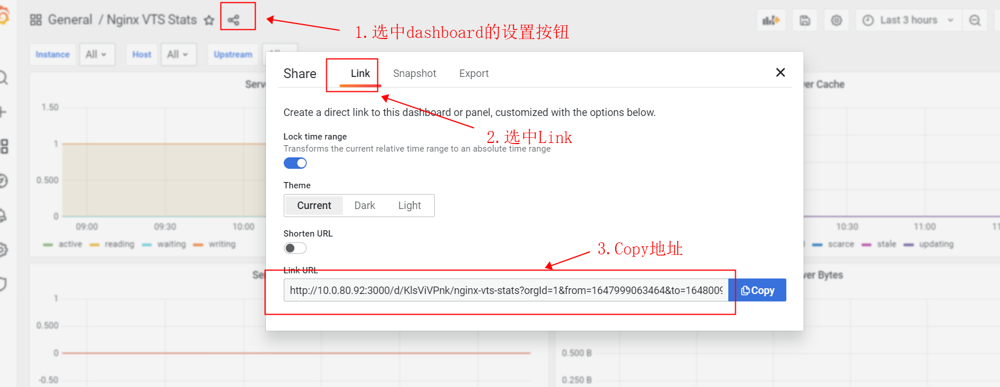
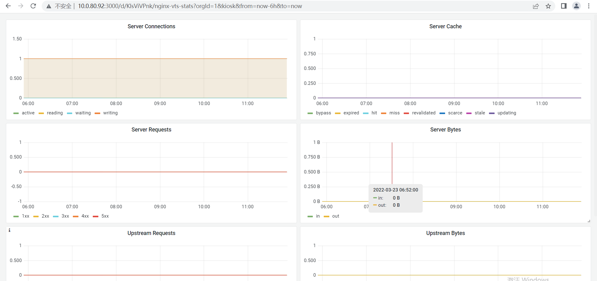

## 配置允许iframe集成

- 要集成，可以选用iframe集成方式，需要配置可以embedding

```properties
# set to true if you want to allow browsers to render Grafana in a <frame>, <iframe>, <embed> or <object>. default is false.
allow_embedding = true
```

- 设置不需要认证
```properties
[auth.anonymous]
# enable anonymous access
enabled = true
```

设置好后重启grafana

## 集成panel

集成dashboard中的某个图表，可以通过图表中的shared/Embed,copy其中的iframe代码即可使用。

## 集成dashboard

- 进入dashboard的设置中的link获得dashboard的url



- 调整url的参数为orgId=1&kiosk&from=now-6h&to=now，例如：

```text
link中copy出来的url：
http://10.0.80.92:3000/d/KlsViVPnk/nginx-vts-stats?orgId=1&from=1647999063464&to=1648009863464
修改为：
http://10.0.80.92:3000/d/KlsViVPnk/nginx-vts-stats?orgId=1&kiosk&from=now-6h&to=now
```

展示如图：


## dashboard的url参数详解

以下面的url为例:

```text
http://10.0.80.92:3000/d/KlsViVPnk/nginx-vts-stats?orgId=1&kiosk&from=now-6h&to=now&var-Instance=nginx177&var-Host=All&var-Upstream=All
```

- orgId：一般为1，待补充
- kiosk：只展示dashboad内容
- from：开始时间，一般赋值时间序列，也可以使用“now-6h”，表示从6小时前开始
- to：结束时间，一般赋值时间序列，也可以使用“now”，表示至当前时间
- var-$variable：“var-”后面跟dashboard的variable参数，如上面的例子，展示Instance为nginx177的dashboard