# 仪表板设计经验总结

## 仪表板设计原则

- 图表要少而精，不要重复
- 仪表板要有明确的用途定位，一个仪表板观测一个维度
- 图表少时要紧凑，尽量第一屏展示所有图表
- 颜色要少而有意义，不要花里胡哨
- 统计列表很重要，统计一段时间的错误率、延时

## 仪表板定位

在设计仪表板时，首先要确定仪表板的用途定位，清晰的功能定位及功能划分，才能让客户易于上手。

介于我现有的经验，我总结有这几类定位：

- 监控大屏：通过监控大屏展示实时的全局状态
  - 首页
  - 节点列表：以列表形式展示所有节点的关键指标
- 日常巡检：能查看一段时间范围内某个服务的情况，能反应出问题，并能定位到节点
  - 服务视图
- 排障：在发现问题后，排障时用
  - 节点视图：以节点维度展示该节点的关键指标

### 监控大屏

也可以叫做首页，其定位就是进入监控系统第一眼要看的仪表板。大屏由于空间有限，所以必须突出重点，不需要面面俱到，展示最重要的影响整个系统运行稳定性的指标。

建议图表：
- 建议使用列表展示指标top 10的对象（比如节点或服务），将主要问题暴露出来。
- 建议列出告警数
- 建议趋势图尽量少，所以只展示客户关心的核心业务指标

ps：可能会有人问有告警通知的话，还需要首页吗？回答是需要的，因为有些重要指标不方便定义告警规则，比如延时

### 节点视图

节点视图目的是展示一个节点的状态，建议尽量展示趋势类图表，减少状态类的图表，因为到节点视图观测问题时，通常是为了定位问题，趋势图是最直观的。

### 服务视图

服务视图目的是展示一个服务的整体状态，其是一个汇总仪表板，汇聚计算所有节点上的服务情况。

建议图表：
- 建议服务视图上要有统计图表，统计一段时间的错误率、延时
- 趋势图

### 节点列表

以列表形式展示所有节点的实时状态，这种形式非常直观，方便定位问题节点。

PS：应急处置分2级，节点、机房，要么个别节点出问题，处理这些节点；要么一个机房中服务可用性超过阈值，从机房层面整体屏蔽。所以节点列表很必要，通常都是处理问题节点。

## 图表类型

此处总结了常用图表类型：

|  类型  |   应用场景                                       |   grafana图表  |
|--------|---------------------------------------------------|----------------|
|  瞬时类 | 展示时间序列指标的瞬间值                          |  Stat(状态图)、Gauge（仪表盘）、Table（列表）、Polystat（聚合状态图）、Bar gauge（柱状状态图）、Multistat（类似Bar gauge）    |
|  趋势类 | 展示指标随着时间变化的趋势                          |  Time series（趋势图）、Stat(状态图) 、stat timeline（状态时间线图）   |
|  比较类 | 展示同一个维度的不同对象的值对比情况，比如展示不同站点的使用量对比          |  Time series（趋势图）、Bar chart（柱状图）    |
|  分布类 | 展示同一个维度的不同对象的分布情况            |  Histogram(直方图)、Heatmaps（热力图）、Time series（趋势图）、Bar chart(柱状图)、State timeline（时间线状态图）    |
|  地图类 | 展示指标在地图上的分布，显示出数据在地理位置上的特征            |  geoMap（地图）    |
|  占比类 | 展示一个维度的对象占比情况            |  Pie charts（饼图）    |
|  拓扑类 | 展示拓扑关系           |  flowcharting（拓扑图）    |

#### 瞬时类

展示时间序列指标的瞬间值

1. Stat：状态图

1. Gauge：仪表盘

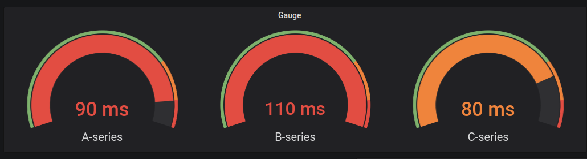
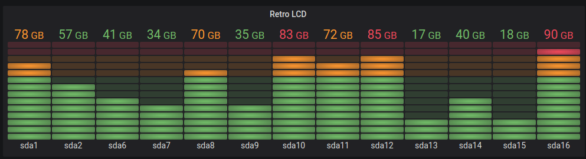

3. Table：列表

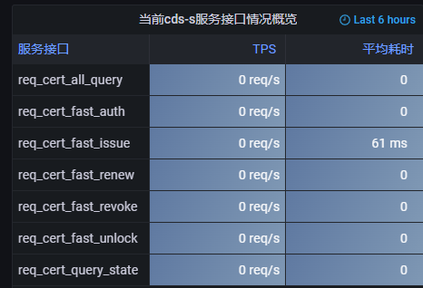

4. Polystat: 类似stat，比stat多一个聚合功能，可以将不同指标根据一个标签聚合在一个方块中。Polystat是根据字符串或者正则匹配进行聚合，无法根据prometheus的标签进行聚合操作，用处不是很大。

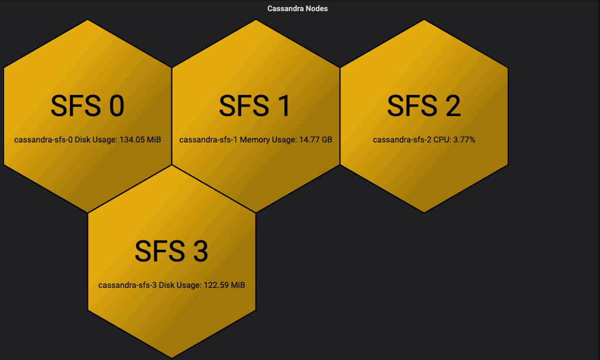

#### 趋势类

展示指标随着时间变化的趋势

1. Time series： 时间趋势图，可以展示成折线图

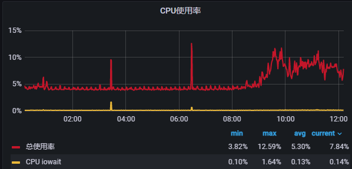

2. Stat：状态图，可以展示大致的趋势，看不到具体值,适用于不占面积的次重要指标

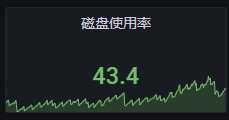

3. stat timeline: 状态时间线图，对于状态类指标（如连通性、后端应用状态等）使用该图表很合适

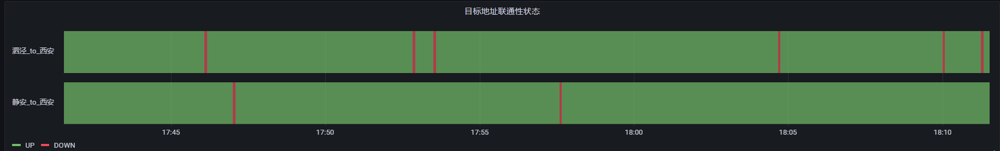

#### 比较类

展示一个维度的对象的值对比情况

1. Time series：可以展示成堆叠图（可以是折线图和柱状图）

进程cpu占比堆叠图，根据堆叠情况可以看出总cpu消耗以及各进程对比情况

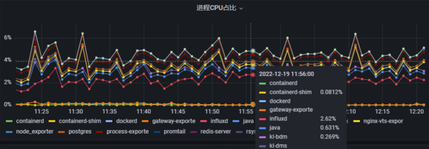

响应码分布情况，可以对比上下游响应码情况

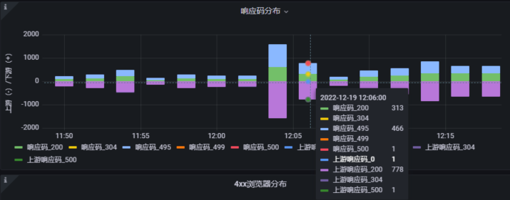

2. Bar chart：柱状图，展示对比情况

#### 分布类

分布同比较是类似的，展示一个维度的对象的分布情况
1. Histogram：直方图

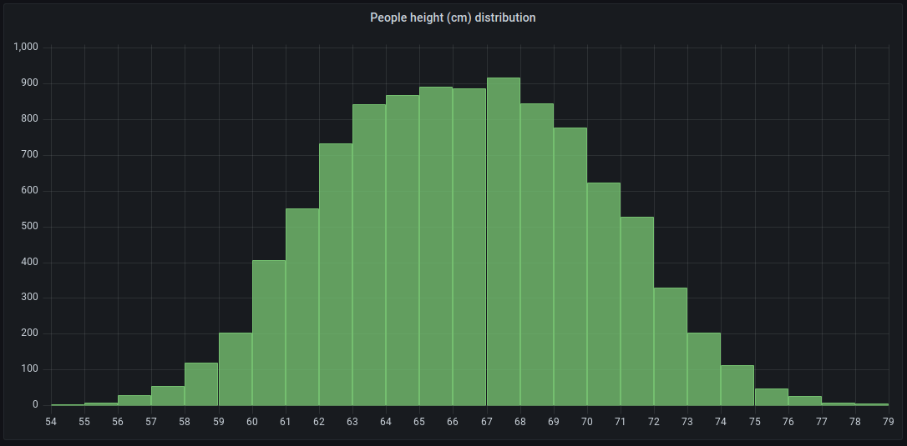

2. Heatmaps：热力图

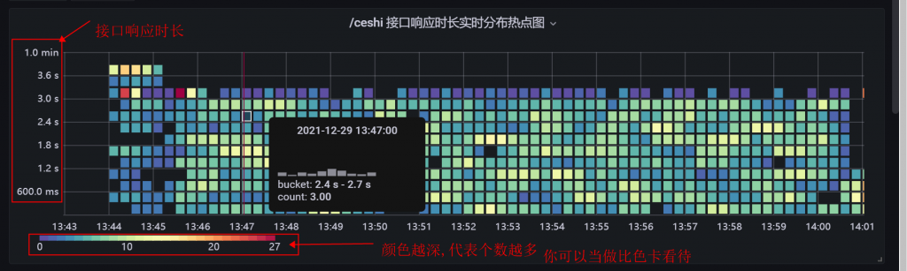

3. Time series：堆叠图可以展示分布情况
4. Bar chart：柱状图，可以展示分布情况
5. State timeline：时间线状态图，显示随时间的离散状态变化。当与时间序列一起使用时，阈值用于将数值转换为离散状态区域。

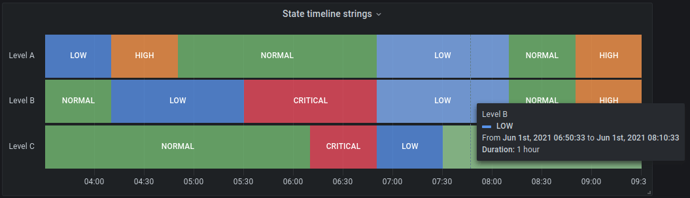

#### 地图类

展示指标在地图上的分布，显示出数据在地理位置上的特征

1. geoMap：地图

#### 占比类

展示一个维度的对象占比情况

1. Pie charts：饼图

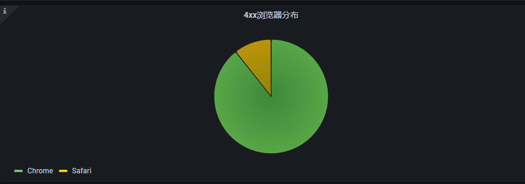

## 制作图表

grafana制作监控图表一些好的实践方法：

- 去除不必要的背景填充
  - 重要的有告警阈值限制的设置背景色，绿色表示正常，黄色表示提醒，红色表示告警
  - 一般的指标无需设置背景色，或者统一用一种浅色调
- 去掉无意义的颜色变化，grafana一些颜色设置去掉
- 图表legend统一放下面，如果legend内容用的是标签值，则以“-”间隔，格式为：标签a值_标签b值
