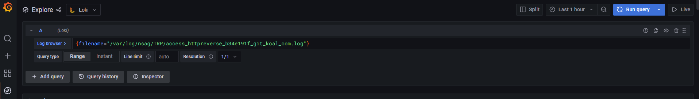
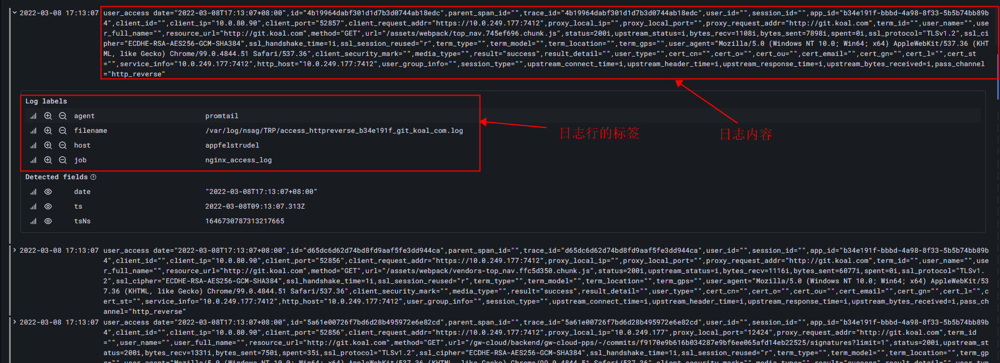
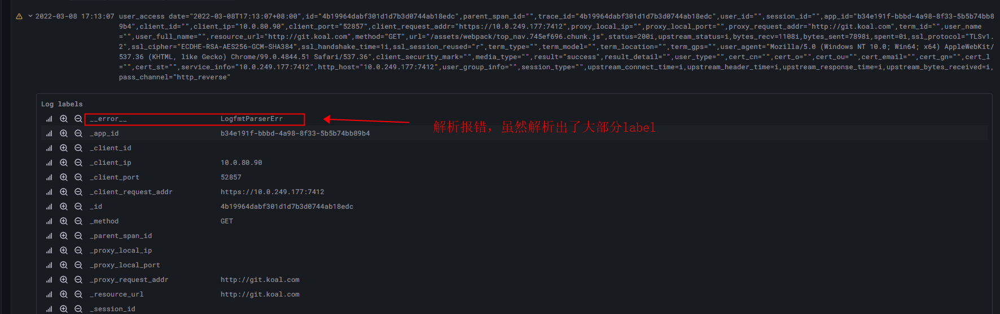
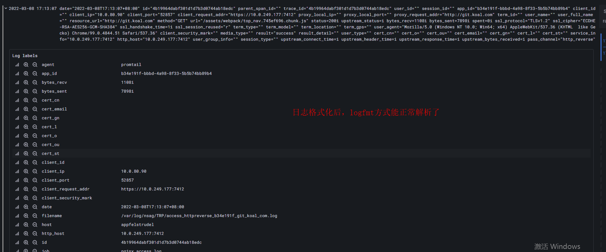

## 目的

解析nginx的访问日志，获取某段时间内status>=500的请求数

## 准备

- 安装nginx、promtail、loki、grafana
- 将loki加入grafana
- 打开grafana的explore页面，进入如下页面，即可后续操作

## 资源的访问日志

- 查询语句：{filename="/var/log/nginx/TRP/access_httpreverse_b34e191f_git_koal_com.log"}

access_httpreverse_b34e191f_git_koal_com.log是资源的访问日志文件,/var/log/nginx/TRP是访问日志所在目录

- 查询出内容：

## 使用logfmt解析方式解析日志

nginx的访问日志更接近logfmt格式，所以用logfmt方式解析日志。

- 查询语句：{filename="/var/log/nginx/TRP/access_httpreverse_b34e191f_git_koal_com.log"}| logfmt
- 查询出内容：
  
发现logfmt是无法解析nginx的日志的

## 先将日志格式化成logfmt格式，再使用logfmt解析

- 查询语句：{filename="/var/log/nginx/TRP/access_httpreverse_b34e191f_git_koal_com.log"} | regexp "user_access (?P<msg>.*)" | line_format `\{\{ Replace .msg ","  " " -1\}\}` | logfmt

- 查询出内容：
  

## 筛选stauts >= 500的日志

- 查询语句：{filename="/var/log/nginx/TRP/access_httpreverse_b34e191f_git_koal_com.log"} | regexp "user_access (?P<msg>.*)" | line_format `\{\{ Replace .msg ","  " " -1\}\}` | logfmt | status >= 500
- 查询出内容：
  解析出错，因为日志中status的值带有字母“i”