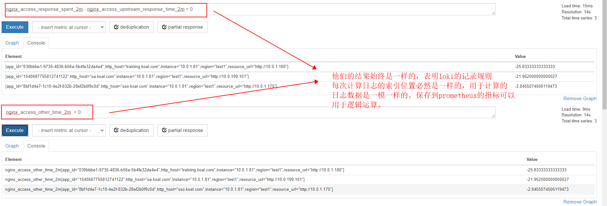

## 前序

loki的记录规则（recording rule）可以定时统计日志的数据并将结果以指标数据保存到prometheus，可以方便grafana展示（grafana直接用loki表达式会很慢）。

## 疑问

- 记录规则是每隔一段时间统计一次，那么它是否会漏掉一段日志？
- 多个记录规则产生的指标之间是否可以逻辑运算？也就是说多个记录规则统计的日志数据是否是一样的？

## 实验

### 原理

创建三个记录规则：
- 记录规则1：nginx_access_response_spent_2m用于统计spent平均耗时；
- 记录规则2：nginx_access_upstream_response_time_2m用于统计upstream_response_time平均耗时；
- 记录规则3：nginx_access_other_time_2m用于统计spent - upstream_response_time的差值的平均耗时；

如果它们三者的统计值最终符合：nginx_access_other_time_2m = nginx_access_response_spent_2m - nginx_access_upstream_response_time_2m，
那么说明这三个记录规则统计的日志数据是一样的，从而证明多个记录规则产生的指标之间可以逻辑运算。另一方面也说明不会存在漏掉一段日志的情况，因为很明显记录规则统计数据
是根据日志中的索引位置依次统计，不会漏掉日志。

### 准备表达式

nginx_access_response_spent_2m：
```text
avg_over_time({instanceType="nginx"}  | regexp ".*app_id=\"(?P<app_id>\\S+)\",client_id=.*resource_url=\"(?P<resource_url>\\S+)\",method.*url=\"(?P<url>\\S+)\",status.*spent=(?P<spent>\\d+)i,ssl_protocol=.*http_host=\"(?P<http_host>\\S+)\",user_group_info=.*"  | unwrap spent  | resource_url != "" and  __error__="" [2m]) by (instance, http_host, app_id, resource_url)
```

nginx_access_upstream_response_time_2m
```text
avg_over_time({instanceType="nginx"}  | regexp ".*app_id=\"(?P<app_id>\\S+)\",client_id=.*resource_url=\"(?P<resource_url>\\S+)\",method.*url=\"(?P<url>\\S+)\",status.*spent=(?P<spent>\\d+)i,ssl_protocol=.*http_host=\"(?P<http_host>\\S+)\",user_group_info=.*upstream_response_time=(?P<upstream_response_time>\\d*)i,upstream_bytes_received=.*" | label_format upstream_response_time=`{{ .upstream_response_time | int }}` |unwrap upstream_response_time  | resource_url != "" and  __error__=""[2m]) by (instance, http_host, app_id, resource_url)
```
注意，表达式中“| label_format upstream_response_time=`{{ .upstream_response_time | int }}`”这段内容是upstream_response_time转化为int，当upstream_response_time为空值转为0，因为upstream_response_time
计算平均值时会排除空值，造成统计结果不准确，所以必须在upstream_response_time为空时赋值0

nginx_access_other_time_2m表达式则是上述两个表达式相减：
```text
avg_over_time({instanceType="nginx"}  | regexp ".*app_id=\"(?P<app_id>\\S+)\",client_id=.*resource_url=\"(?P<resource_url>\\S+)\",method.*url=\"(?P<url>\\S+)\",status.*spent=(?P<spent>\\d+)i,ssl_protocol=.*http_host=\"(?P<http_host>\\S+)\",user_group_info=.*"  | unwrap spent  | resource_url != "" and  __error__="" [2m]) by (instance, http_host, app_id, resource_url)
-
avg_over_time({instanceType="nginx"}  | regexp ".*app_id=\"(?P<app_id>\\S+)\",client_id=.*resource_url=\"(?P<resource_url>\\S+)\",method.*url=\"(?P<url>\\S+)\",status.*spent=(?P<spent>\\d+)i,ssl_protocol=.*http_host=\"(?P<http_host>\\S+)\",user_group_info=.*upstream_response_time=(?P<upstream_response_time>\\d*)i,upstream_bytes_received=.*" | label_format upstream_response_time=`{{ .upstream_response_time | int }}` |unwrap upstream_response_time  | resource_url != "" and  __error__=""[2m]) by (instance, http_host, app_id, resource_url)
```

将记录规则配置到loki

### 结果

经过1个小时后，通过prometheus查询：
- nginx_access_response_spent_2m-nginx_access_upstream_response_time_2m
- nginx_access_other_time_2m
对比这两各表达式的结果，发现结果一致：


## 结论

- loki记录规则的运行过程可能是这样的：每隔一个周期，确定要统计的日志开始索引位置和结束索引位置，所有记录规则都统计开始索引和结束索引之间的日志。下一个周期时，上一个周期的
结束索引作为这个周期的开始索引，并确定这个周期的结束索引，然后继续统计。
- loki记录规则产生的prometheus指标可以互相逻辑运算，因为他们基于同一段日志数据（参与统计的日志的开始索引和结束索引都一致）的统计结果。
基本可以确认这两个结论。