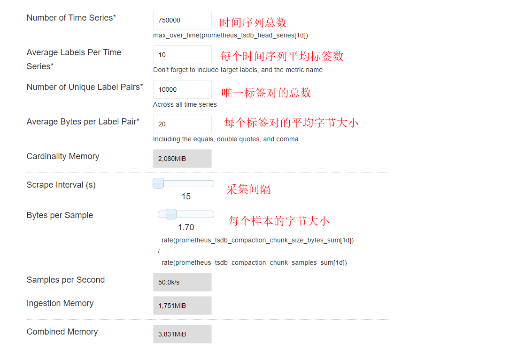
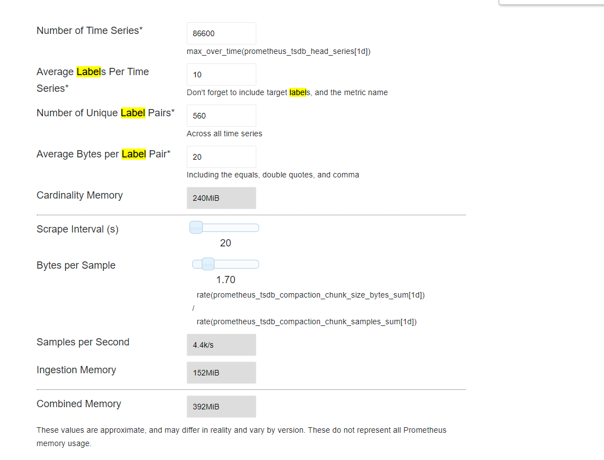

# prometheus的资源使用量计算指导手册

- [prometheus的资源使用量计算指导手册](#prometheus的资源使用量计算指导手册)
  - [1.修订记录](#1修订记录)
  - [2.阅读前提](#2阅读前提)
  - [3.术语解释](#3术语解释)
  - [4.手册说明](#4手册说明)
  - [5.本司主要服务的每次采集样本数](#5本司主要服务的每次采集样本数)
  - [6.内存使用量的计算](#6内存使用量的计算)
    - [6.1.估算例子](#61估算例子)
  - [7.磁盘使用量的计算](#7磁盘使用量的计算)
    - [7.1.估算例子](#71估算例子)
  - [8.带宽使用量的计算](#8带宽使用量的计算)
    - [8.1.每次采集服务网络流量总和的计算](#81每次采集服务网络流量总和的计算)
    - [8.2.估算例子](#82估算例子)

## 1.修订记录

| 日期     | 版本   | 修订内容简述 |
| :------: | :----------: | :----: |
| 20230426 | 1.0 | 初版 |

## 2.阅读前提

- 对Prometheus的概念有所了解，本文只会提供大概的解释

## 3.术语解释

- 指标名称(Metrics Name)和标签(Label)：每⼀条时间序列由指标名称以及⼀组标签（键值对）唯⼀标识
- 样本(Sample)：构成实际的时间序列数据。每个数据样本包括：
  - 毫秒精度的时间戳
  - 64 位浮点型数值
- 标签对(Label Pairs)：一个标签的键值对构成一个标签对，也就是label key + label value，当label key + label value唯一时就是唯一标签对（Unique Label Pairs）
- 时间序列(Time Series)：⼀条时间序列由指标名称以及⼀组标签构成一个时间序列，也就是metric + label set，并且metric + label set要唯一

## 4.手册说明

本手册描述了如何计算prometheus在监控本司网关系统时资源的使用量，帮助客户合理规划promehtues的资源配置。

涉及的资源有内存、磁盘、带宽。注意，此处建议CPU使用大于等于4核。

## 5.本司主要服务的每次采集样本数

以下为本司产品的主要服务每次采集样本数，误差在10以内。

|  服务    |  每次采集样本数    |
|----------|-------------------|
| CDS      |    200        |
| SKS       |   80          |
| KMS       |  60            |
| node-exporter |  900        |

网关产品的每次采集样本数和代理服务的数目有关联，这里列出nginx网关的计算公式。

|  服务    |  每次采集样本数计算公式    |
|----------|-------------------|
| nginx      |    4 * 证书数 + 14 * 代理数 + 10 * 后端服务数   |

## 6.内存使用量的计算

prometheus的内存消耗主要体现在采集存储和构建索引这两块。你可以直接使用官方博客提供的计算器来预估内存使用量：

https://www.robustperception.io/how-much-ram-does-prometheus-2-x-need-for-cardinality-and-ingestion/



1. 时间序列总数（Number of Time Series*） ≈ 所有服务的每次采集样本数总和
2. 每个时间序列平均标签数（Average Labels Per Time Series*） = 10
3. Unique Label Pairs* 它的数目是估算值，CDS服务、SKS服务、KMS服务的标签对大概50左右，网关的标签对和证书数、代理服务数、后端服务数有关。<br>
唯一标签对数目（Number of Unique Label Pairs*） ≈ 节点数 * 2 + 证书数目 * 3 + 代理服务数目 * 2 + 后端服务数目 * 2 + 300 
1. 每个标签对的平均字节大小（Average Bytes per Label Pair*） ≈ 20
2. 采集间隔（Scrape Interval (s)） = 20s
3. 每个样本的字节大小（Bytes per Sample） = 1.7


### 6.1.估算例子

某证券上海机房中有50台“SKSGW+SKS”节点，现场10台“CDS+KMS”节点，SKSGW配置了10个代理服务，这些代理服务后端一共30个后端服务，证书20个，采集周期为20s。

```
# SKSGW每次采集样本数 = 4 * 证书数 + 14 * 代理数 + 10 * 后端服务数
SKSGW每次采集样本数 = 4 * 20 + 14 * 10 + 10 * 30 = 520

# 时间序列总数 = SKSGW每次采集样本数 * SKSGW数 + node-exporter每次样本数 * node-exporter数 + SKS每次样本数 * SKS服务数 + CDS每次样本数 * CDS服务数 + KMS每次样本数 * KMS服务数
时间序列总数 = 520 * 50 + 900 * 60 + 80 * 50 + 200 * 10 + 60 * 10 = 26000 + 54000 + 4000 + 2000 + 600 = 86600

# 唯一标签对数目 = 节点数*2 + 证书数*3 + 代理服务数 * 2 + 后端服务数 * 2 + 300 
唯一标签对数目 = 60 * 2 + 20 * 3 + 10 * 2 + 30 * 2 + 300 = 120 + 60 + 20 + 60 + 300 = 560
```

使用博客上内存消耗的计算器进行计算：



该机房的prometheus内存使用量大约392 MB。


## 7.磁盘使用量的计算

磁盘使用量的公式如下：
```
磁盘使用量 = 每个样本的字节大小 * (存储天数 * 24 * 60 * 60 / 采集间隔) * 时间序列总数 * 1.2  （字节）
```

### 7.1.估算例子

某证券上海机房中有50台“SKSGW+SKS”节点，现场10台“CDS+KMS”节点，SKSGW配置了10个代理服务，这些代理服务后端一共30个后端服务，证书20个，采集周期为20s,采集周期为30天。

```
# SKSGW每次采集样本数 = 4 * 证书数 + 14 * 代理数 + 10 * 后端服务数
SKSGW每次采集样本数 = 4 * 20 + 14 * 10 + 10 * 30 = 520

# 时间序列总数 = SKSGW每次采集样本数 * SKSGW数 + node-exporter每次样本数 * node-exporter数 + SKS每次样本数 * SKS服务数 + CDS每次样本数 * CDS服务数 + KMS每次样本数 * KMS服务数
时间序列总数 = 520 * 50 + 900 * 60 + 80 * 50 + 200 * 10 + 60 * 10 = 26000 + 54000 + 4000 + 2000 + 600 = 86600

# 磁盘使用量 = 每个样本的字节大小 * (存储天数 * 24 * 60 * 60 / 采集间隔) * 时间序列总数 * 1.2  （字节）
磁盘使用量 = 1.7 * (30 * 24 * 60 * 60 / 20) * 86600 * 1.2 （字节）= 21.32 （GB）
```

该机房的prometheus磁盘使用量大约21.32 GB。

## 8.带宽使用量的计算

promehtues采用错峰采集，在传输时使用gzip对采集数据进行了压缩，对网络带宽的消耗时极低的。

带宽计算公式：

```
带宽 = 每次采集服务网络流量总和 / 采集间隔
```

### 8.1.每次采集服务网络流量总和的计算
此处统计了测试环境的各服务每次采集的实际采集样本大小、网络流量大小以及压缩比：

|  服务  |   采集样本大小       |  网络流量大小          |    压缩比        |
|-------|----------------------|----------------------|------------------|
|  CDS   |    50KB      |   2.64KB       |     19      |
|  KMS   |    21KB      |   1.31KB       |     15.6      |
|  SKS   |    21.2KB      |   1.33KB       |     15.9      |
|  网关   |    80KB      |   9.15KB      |     8.74      |
|  node-exporter   |    75KB      |   12.7KB      |     5.9      |

以上网络流量大小可以直接作为我们计算带宽使用量的参数，这是因为：CDS、KMS、SKS、node-exporter的样本数是几乎不变的，其次网关的样本数在变，但在样本变大的时候，实际指标还是那几个，文本内容是高度雷同的，在gzip压缩算法下可以忽略高度雷同内容的增加。

```
每次采集服务网络流量总和 = CDS数 * 2.64 + KMS数 * 1.31 + SKS数 * 1.33 + 网关数 * 9.15 + 节点数 * 12.7
```

### 8.2.估算例子

某证券上海机房中有50台“SKSGW+SKS”节点，现场10台“CDS+KMS”节点，SKSGW配置了10个代理服务，这些代理服务后端一共30个后端服务，证书20个，采集周期为20s,采集周期为30天。

```
# 每次采集服务网络流量总和 = CDS数 * 2.64 + KMS数 * 2.61 + SKS数 * 1.33 + 网关数 * 9.15 + 节点数 * 12.7
每次采集服务网络流量总和 = 10 * 2.64 + 10 * 2.61 + 50 * 1.33 + 50 * 9.15 + 60 * 12.7 = 26.4 + 13.1 + 66.5 + 457.5 + 762 = 1325.5KB

# 带宽 = 每次采集服务网络流量总和 / 采集间隔
带宽 = 1325.5KB / 20s = 66.275 （KB/s）
```

该机房的prometheus带宽使用量大约66.275 KB/s。
