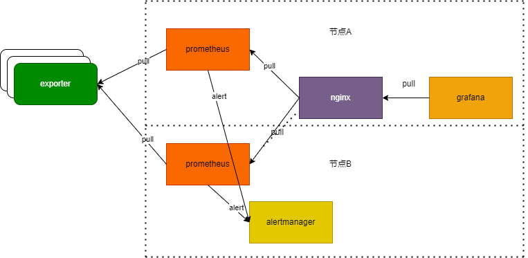
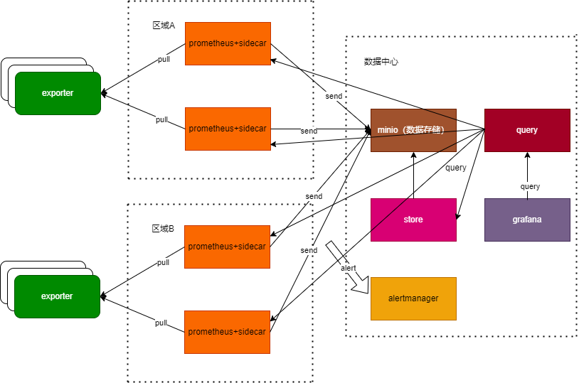

# prometheus高可用部署方案

## 修订记录

| 日期     | 版本   | 修订内容简述 |
| :------: | :----------: | :----: |
| 20221206 | 1.0 | 初版 |

## 概要说明

对于高可用，prometheus官方提供了几种方案：

- HA：即两套 prometheus 采集完全一样的数据，外边挂负载均衡。
- HA + 远程存储：除了基础的多副本prometheus，还通过Remote write 写入到远程存储，解决存储持久化问题。
- 联邦集群：即federation，按照功能进行分区，不同的 shard 采集不同的数据，由Global节点来统一存放，解决监控数据规模的问题。

这三种方式中，HA可以应对小规模、只保存短周期监控数据的场景；HA+远程存储可以应对小规模、但需要保存长周期监控数据的场景；联邦集群可以应对大规模、且需要保存长周期监控数据的场景。
HA方式应对小规模问题不大，会存在数据一致性问题，但不影响告警和图表展示。但是联邦集群应对大规模场景始终还是避免单点性能瓶颈。

本文档提供了两种部署方案：描述了HA方案的部署，以应对小规模场景；描述了thanos方案的部署，以应对大规模分布式场景,根据机房区域的分布可以加入联邦机制。

### 方案选择建议

方案的选择和被监控对象的数量和分布有关系。
首先，数量上，单机prometheus在不同配置的服务器上可监控的协同网关数目是不一样的，具体可以参考《协同监控告警部署手册》中“所需资源规划建议”。如果超过服务器承载的网关数目，就可以选择使用thanos方案。
其实，要看网关分布区域，如果分布区域多且各区域到数据中心网络存在延时，那么建议使用thanos方案，每个区域部署一组prometheus，数据中心部署thanos，数据最终汇总到数据中心。

## HA方案

### 架构



这个架构简单易部署，采用两套prometheus同时采集exporter，形成高可用，前置一个负载均衡（nginx），grafana等外部应用可以直接请求nginx。另外，两个prometheus同时向alertmanager发出告警信息。
这里部分人可能会产生质疑。第一个质疑：两个prometheus是否会造成数据一致性问题？数据一致性问题肯定存在，两个prometheus的数据肯定是不一致的，但是不会影响外部系统，grafana图表的展示不会受到任何影响，
因为prometheus是时序数据库，样本数据都是随着时间变动的，grafana等外部系统获得的指标趋势和实时数据都是真实可靠的，不会存在问题。第二个质疑：两个prometheus同时发出告警给alertmanager，是否会
产生两条告警信息？在alertamanger中加上抑制策略即可避免该问题。

### 部署

如架构图，部署在两台节点上，一个节点部署prometheus+nginx+grafana；一个部署prometheus+alertmanager。
1. 部署prometheus，prometheus和grafana的安装部署参考《协同监控告警部署手册》。

2. 在部署两个promethes后，再部署一个nginx。nginx配置如下：
```
upstream prometheus-server {
  server {prometheus1_ip}:9090 weight=50 max_fails=2 fail_timeout=30s;
  server {prometheus2_ip}:9090 weight=50 max_fails=2 fail_timeout=30s;
}
server {
  listen 19001;
  server_name localhost;
  charset utf-8;
  default_type text/html;
  location /{
    proxy_set_header Host $http_host;
    proxy_set_header X-Forwarded-For $remote_addr;
    client_body_buffer_size 10M;
    client_max_body_size 10G;
    proxy_buffers 1024 4k;
    proxy_read_timeout 300;
    proxy_next_upstream error timeout http_404;
    proxy_pass http://prometheus-server;
  }
}
```
{prometheus1_ip}和{prometheus2_ip}分别填写为那两台prometheus节点的ip。
3. 部署grafana，同《协同监控告警部署手册》不同的步骤是，加prometheus数据源时，地址填nginx代理地址：http://{nginxIp}:19001，{nginxIp}填写为nginx所在的ip。

HA部署就是这么简单，部署好之后，按照《协同监控告警部署手册》中的方式配置prometheus，并导入grafana模板即可实现对协同签名系统的监控。

## thanos方案

### 架构



首先，说明一下thanos，thanos包含sidecar、query、store、rules、compact、front等6个组件，我们这里使用了其中3个，根据实际情况可以再加。
在thanos方案中，每个区域（或机房）部署两套prometheus+sidecar，在数据中心部署query+minio+store+grafana以及alertmanager。每个区域的数据会通过sidecar汇总到minio中，query通过sidecar和store组件
查询数据。grafana对接query组件。另外告警规则仍然放在prometheus中，prometheus可以直接把告警发送给alertmanager。

### 安装包下载

prometheus参考《协同监控告警部署手册》

#### thanos下载

- [thanos下载地址](https://github.com/thanos-io/thanos/releases)
- 下载命令：
```
[root@server #] curl https://github.com/thanos-io/thanos/releases/thanos-0.30.2.linux-amd64.tar.gz \
  --create-dirs \
  -o /opt/thanos-0.30.2.linux-amd64.tar.gz
```

#### minio下载

- [mino下载安装官网说明](http://docs.minio.org.cn/minio/baremetal/tutorials/minio-installation.html#minio-installation)
- 下载二进制可执行文件貌似存在问题，推荐使用使用rpm包和deb包。
deb包下载:
```
[root@server #] curl https://dl.minio.org.cn/server/minio/release/linux-amd64/archive/minio_20230227181045.0.0_amd64.deb \
  --create-dirs \
  -o /opt/minio_20230227181045.0.0_amd64.deb
```
rpm包下载:
```
[root@server #] curl https://dl.minio.org.cn/server/minio/release/linux-amd64/archive/minio-20230227181045.0.0.x86_64.rpm \
  --create-dirs \
  -o /opt/minio-20230227181045.0.0.x86_64.rpm
```

### prometheus部署

prometheus部署参照《协同监控告警部署手册》。需要注意的是，在thanos方案中，prometheus的启动命令需要修改为：

```
/opt/prometheus/prometheus --storage.tsdb.path="/var/data/prometheus/" \
--storage.tsdb.max-block-duration=2h \
--storage.tsdb.min-block-duration=2h \
--storage.tsdb.wal-compression \
--storage.tsdb.retention.time=2h \
--web.enable-lifecycle --storage.tsdb.retention=30d --config.file=/opt/prometheus/prometheus.yml > /var/log/prometheus.log
```

prometheus启动命令配置在/etc/systemd/system/prometheus.service文件中，参考《协同监控告警部署手册》中prometheus“开机自启动”章节。

对此处使用到的重要prometheus启动参数释义：
- web.enable-lifecycle：开启prometheus热加载，一定要配置；
- storage.tsdb.retention.time：保留数据时长，可保留2小时，prometheus默认2小时会生成一个 block，thanos会把这个block上传到对象存储。
- storage.tsdb.max-block-duration、storage.tsdb.min-block-duration：block大小，保持同retention保留时长一致。

### minio安装

minio需要安装在单独主机，机器要求磁盘够大，在遇到数据量大时可以随时扩容。

1. 安装，在centos、redhat等系统，使用rpm包安装：
```
[root@server #] sudo yum install /opt/minio-20230227181045.0.0.x86_64.rpm
```
在debian、ubuntu等系统，使用deb包安装：
```
[root@server #] sudo dpkg -i /opt/minio-20230227181045.0.0.x86_64.rpm
```
2. 设置minio启动参数，在/etc/default/minio文件中配置启动参数:
```
[root@server #] vi /etc/default/minio
```
将如下内容拷贝到/etc/default/minio文件:
```
MINIO_ACCESS_KEY="minioadmin"
MINIO_SECRET_KEY="minioadmin"
MINIO_VOLUMES="/var/data/minioserver/"
MINIO_OPTS="--address :9001"
```
参数说明：
- MINIO_ACCESS_KEY：minio的登录用户名
- MINIO_SECRET_KEY：minio的登录密码
- MINIO_VOLUMES：minio的数据存放目录
- MINIO_OPTS：minio的启动参数，指定了访问端口为9001

3. 启动minio：
```
[root@server #] systemctl daemon-reload
[root@server #] systemctl start minio
[root@server #] systemctl status minio
[root@server #] systemctl enable minio.service
```
4. 打开minio启动页面http://{ip}:9001/，可以看到登录界面，输入用户名（minioadmin）密码（minioadmin），进入到界面，
打开菜单Administrator/Buckets，创建名称为"prometheus"的bucket。

然后在prometheus这个bucket上创建保留策略，设置数据保存时间（默认为永久）。


### minio集群配置

1. minio集群最少4台机器，在按上面的步骤安装4个minio节点后，修改minio的启动参数，打开/etc/default/minio文件,修改MINIO_OPTS参数为：
```
MINIO_OPTS="--address :9001 http://{ip}:9001/home/minio/data http://{ip}:9001/home/minio/data http://{ip}:9001/home/minio/data http://{ip}:9001/home/minio/data"
```
上面是把每个minio的http://{ip}:9001/home/minio/data的路径丰富到启动参数中，然后重启即可：
```
[root@server #] systemctl restart minio
```
2. minio集群需要前置一个代理，安装nginx，配置nginx：
配置nginx 支持lb（支持集群节点；支持多集群混用）
```
upstream minio-server {
  server 192.168.90.134:9001 weight=25 max_fails=2 fail_timeout=30s;
  server 192.168.90.135:9001 weight=25 max_fails=2 fail_timeout=30s;
  server 192.168.90.136:9001 weight=25 max_fails=2 fail_timeout=30s;
  server 192.168.90.137:9001 weight=25 max_fails=2 fail_timeout=30s;
}
server {
  listen 9001;
  server_name localhost;
  charset utf-8;
  default_type text/html;
  location /{
    proxy_set_header Host $http_host;
    proxy_set_header X-Forwarded-For $remote_addr;
    client_body_buffer_size 10M;
    client_max_body_size 10G;
    proxy_buffers 1024 4k;
    proxy_read_timeout 300;
    proxy_next_upstream error timeout http_404;
    proxy_pass http://minio-server;
  }
}
```

### 部署 sidecar 组件

sidecar要与prometheus部署在一台主机，每个sidecar对应一个prometheus.sidecar是用于收集prometheus数据并持久化到mino中。
1. 安装过程：
```
[root@server #] tar -xzvf thanos-0.30.2.linux-amd64.tar.gz
[root@server #] mv thanos-0.30.2.linux-amd64 ./thanos
[root@server #] cd ./thanos
```
2. 修改bucket_config.yaml配置文件内容：
```
type: S3
config:
  bucket: "test"
  endpoint: "minio:9000"
  access_key: "minioadmin"
  secret_key: "minioadmin"
  insecure: true
```
1. 启动：
```
[root@server #] ./thanos sidecar \
--prometheus.url="http://localhost:8090" \
--objstore.config-file=./bucket_config.yaml \
--tsdb.path=/var/data/prometheus/
```

### 部署 query 组件

sidecar暴露了StoreAPI，Query从多个StoreAPI中收集数据，查询并返回结果。Query是完全无状态的，可以水平扩展。
1. 安装过程：
```
[root@server #] tar -xzvf thanos-0.30.2.linux-amd64.tar.gz
[root@server #] mv thanos-0.30.2.linux-amd64 ./thanos
[root@server #] cd ./thanos
```
2. 启动：

```
[root@server #] ./thanos query \
--http-address="0.0.0.0:8090" \
--store=relica0:10901 \
--store=relica1:10901 \
--store=relica2:10901 \
--store=127.0.0.1:19914 \
```

### 部署 store gateway 组件

Store gateway 主要与对象存储交互，从对象存储获取已经持久化的数据。与sidecar一样，Store gateway也实现了store api，query 组可以从 store gateway 查询历史数据。
1. 安装过程：
```
[root@server #] tar -xzvf thanos-0.30.2.linux-amd64.tar.gz
[root@server #] mv thanos-0.30.2.linux-amd64 ./thanos
[root@server #] cd ./thanos
```
2. 修改bucket_config.yaml配置文件内容：
```
type: S3
config:
  bucket: "test"
  endpoint: "minio:9000"
  access_key: "minioadmin"
  secret_key: "minioadmin"
  insecure: true
```
1. 启动：
```
./thanos store \
--data-dir=./thanos-store-gateway/tmp/store \
--objstore.config-file=./bucket_config.yaml \
--http-address=0.0.0.0:19904 \
--grpc-address=0.0.0.0:19914 \
--index-cache-size=250MB \
--sync-block-duration=5m \
--min-time=-2w \
--max-time=-1h \
```

### 部署grafana

grafana的部署参考《协同监控告警部署手册》，唯一区别是，配置prometheus数据源时，填写query的地址。
