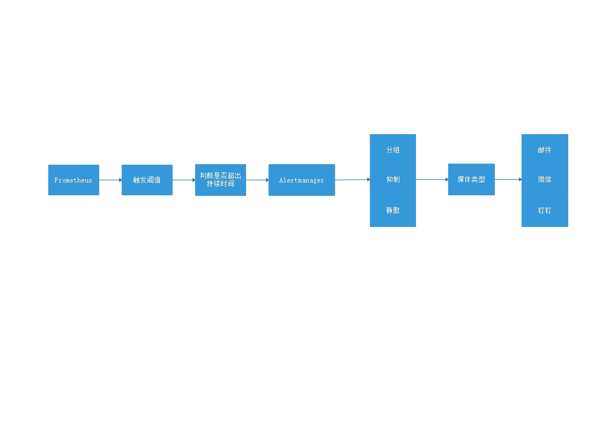

## 通过本篇可以了解

- Prometheus-Alertmanager的告警流程，以及告警频率相关参数的作用
- 告警流程中的数据结构
- Alertmanager分组的作用

## 报警处理流程



报警处理流程如下：
1. Prometheus Server监控目标主机上暴露的http接口或exporter，通过上述Promethes配置的'scrape_interval'定义的时间间隔，定期采集目标主机上监控数据。
2. 当接口A不可用的时候，Server端会持续的尝试从接口中取数据，直到"scrape_timeout"时间后停止尝试。这时候把接口的状态变为“DOWN”。
3. Prometheus同时根据配置的"evaluation_interval"的时间间隔，定期（默认1min）的对Alert Rule进行评估；当到达评估周期的时候，发现接口A为DOWN，即UP=0为真，激活Alert，进入“PENDING”状态，并记录当前active的时间；
4. 当下一个alert rule的评估周期到来的时候，发现UP=0继续为真，然后判断警报Active的时间是否已经超出rule里的‘for’ 持续时间，如果未超出，则进入下一个评估周期；如果时间超出，则alert的状态变为“FIRING”；同时调用Alertmanager接口，发送相关报警数据。
5. AlertManager收到报警数据后，会将警报信息进行分组，然后根据alertmanager配置的“group_wait”时间先进行等待。等wait时间过后再发送报警信息。
6. 属于同一个Alert Group的警报，在等待的过程中可能进入新的alert，如果之前的报警已经成功发出，那么间隔“group_interval”的时间间隔后再重新发送报警信息。比如配置的是邮件报警，那么同属一个group的报警信息会汇总在一个邮件里进行发送。
7. 如果Alert Group里的警报一直没发生变化并且已经成功发送，等待‘repeat_interval’时间间隔之后再重复发送相同的报警邮件；如果之前的警报没有成功发送，则相当于触发第6条条件，则需要等待group_interval时间间隔后重复发送。
   同时最后至于警报信息具体发给谁，满足什么样的条件下指定警报接收人，设置不同报警发送频率，这里有alertmanager的route路由规则进行配置。

### Promethes间隔时间配置

Prometheus可以配置全局
```yaml
global:
  scrape_interval:     60s # 全局拉取间隔
  evaluation_interval: 60s # 告警评估间隔
  scrape_timeout:      20s # 全局拉取超时
```
也可以配置每个job中配置
```yaml
scrape_configs:
  - job_name: nginx
    scrape_interval:     60s # 拉取间隔
    scrape_timeout:      20s # 拉取超时
    static_configs:
      - targets: ['10.0.249.177:9913']
        labels:
          instance: nginx
```

### AlertManager中间隔时间配置

```yaml
# 告警通知路由，配置组
route:
   group_by: ['alertname']  # 报警分组
   group_wait: 5s # 当收到告警的时候，等待5秒确认时间内是否有新告警，如有则一并发送
   group_interval: 5s # 每隔 5s 巡视一下组内信息，看看是否有信息需要发送，并且将信息按一条发送
   repeat_interval: 5m # 发送报警间隔，如果报警在指定时间内没有修复，则重新发送报警。通常设置较大
   receiver: 'email'
   routes:
      - match:
           team: operations     #根据team标签进行匹配，走不同的接收规则
        receiver: 'ops'
      - match_re: # 正则方式匹配service标签
           service: ^(cpu|ram|dev)$
        receiver: team-X-webhook
      - match: # 匹配severity为critical
           severity: critical
        receiver: team-nginx
```

## 数据结构

按 Prometheus 的官网表述，Prometheus 的告警输出叫 alert。AlertMangaer 的输出是 alert notification。
- metric:exporter的时序数据输出，Prometheus接收并持久化的数据
- alert:Prometheus的告警输出，AlertManager接收并保存的数据，只是缓存，重启Alertmanager后置空
- alert notification（后面简称notification）：Alertmanager的输出

### metric数据结构

拉取exporter的文本内容：
```text
# HELP nginx_server_requests requests counter
# TYPE nginx_server_requests counter
nginx_server_requests{code="1xx",host="dev.koal.com"} 0
nginx_server_requests{code="2xx",host="dev.koal.com"} 7.892025e+06
nginx_server_requests{code="3xx",host="dev.koal.com"} 2.322368e+06
nginx_server_requests{code="4xx",host="dev.koal.com"} 47173
nginx_server_requests{code="5xx",host="dev.koal.com"} 1387
nginx_server_requests{code="total",host="dev.koal.com"} 1.0262953e+07
# 下一段metric

```

通过Prometheus http api获取的数据,访问路径http://10.0.80.92:9090/api/v1/query?query=nginx_server_requests
```json
{
  "status": "success",
  "data": {
    "resultType": "vector",
    "result": [
      {
        "metric": {
          "__name__": "nginx_server_requests", // __name__，code，host，instance，job都是metric的标签
          "code": "1xx",
          "host": "dev.koal.com",
          "instance": "nginx",
          "job": "nginx"
        },
        "value": [
          1646284305.088,
          "0"
        ]
      },
      {
        "metric": {
          "__name__": "nginx_server_requests",
          "code": "2xx",
          "host": "dev.koal.com",
          "instance": "nginx1",
          "job": "nginx1"
        },
        "value": [
          1646284305.088,
          "7.892025e+06"
        ]
      },
      {
        "metric": {
          "__name__": "nginx_server_requests",
          "code": "3xx",
          "host": "dev.koal.com",
          "instance": "nginx1",
          "job": "nginx1"
        },
        "value": [
          1646284305.088,
          "2.322368e+06"
        ]
      }
    ]
  }
}
```
- 标签：metric中__name__，code，host，instance，job都是metric的标签，标签是Prometheus的查询表达式的重要部分。
- 值：value中是metric的时间和值，1646284305.088是时间

### alert数据结构

prometheus输出的alert数据结构，通过Prometheus的http api获得（http://10.0.80.92:9090/api/v1/alerts）
```json
{
  "status": "success",
  "data": {
    "alerts": [{
      "labels": {
        "alertname": "nginx_server_connections_large",
        "instance": "nginx",
        "job": "nginx",
        "severity": "1",
        "status": "accepted",
        "team": "nginx"
      },
      "annotations": {
        "summary": "nginx 的后台连接超过10个的情况已超过 15s！"
      },
      "state": "firing",
      "activeAt": "2022-03-02T04:00:32.81990856Z",
      "value": "5.5e+01"
    }, {
      "labels": {
        "alertname": "nginx_upstream_requests_3xx_alert",
        "instance": "nginx1",
        "severity": "1",
        "team": "nginx"
      },
      "annotations": {
        "summary": "nginx1 的5分钟upstream请求出现3xx过高已超过 15s！"
      },
      "state": "firing",
      "activeAt": "2022-03-03T05:01:32.81990856Z",
      "value": "2.5000416673611228e+00"
    }]
  }
}
```
- labels：标签集，这些标签是在prometheus的告警规则中指定的，alertmanager中依靠这些标签配置路由，将notification发送到不同的接收者
- annotations.summary：摘要信息
- state：状态，在prometheus有Inactive、pending、firing

### notification数据结构

```json
{
	"annotations": {
		"summary": "nginx1 的5分钟缓存命中数过高已超过 15s！"
	},
	"endsAt": "2022-03-03T07:18:32.819Z",
	"fingerprint": "a9a93e332441be13",
	"receivers": [{
		"name": "team-nginx"
	}],
	"startsAt": "2022-03-03T07:08:32.819Z",
	"status": {
		"inhibitedBy": [],
		"silencedBy": [],
		"state": "active"
	},
	"updatedAt": "2022-03-03T07:14:32.839Z",
	"generatorURL": "http://5fd163d9facd:9090/graph?g0.expr=sum+by%28instance%29+%28irate%28nginx_server_cache%7Bstatus%3D~%22hit%22%7D%5B5m%5D%29%29+%3E%3D+4\u0026g0.tab=1",
	"labels": {
		"alertname": "nginx_server_cache_hit_alert",
		"instance": "nginx1",
		"severity": "1",
		"team": "nginx"
	}
}
```
比alert多了些内容：
- receivers：接收者
- status.inhibitedBy：抑制规则
- status.silencedBy：静默规则
- generatorURL：回访alertmanager的url地址，可以在启动命令中配置地址，如：./alertmanager  --web.external-url='http://192.168.2.4:9093/'


